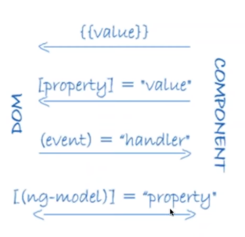
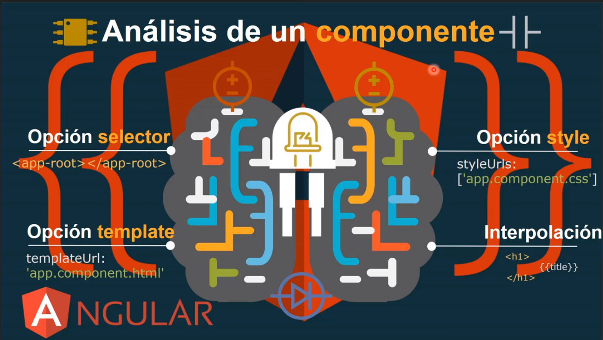
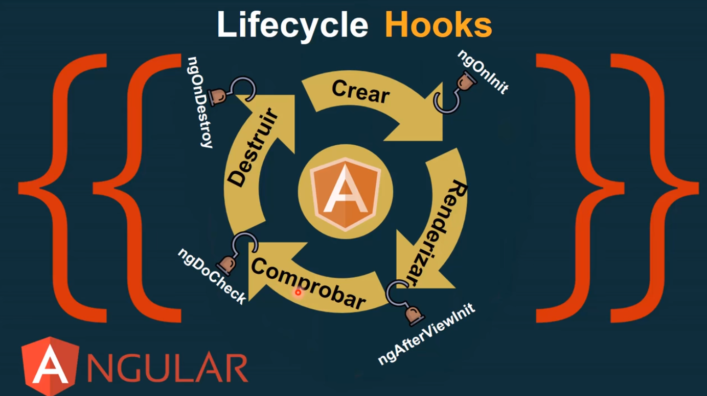

# ANGULAR SPA
## Versions 4 & 5

## Tutorials

Curso Angular 2: https://www.youtube.com/watch?v=4svZDEEeZDc&list=PLYPjmy5IVxT8-9vxaY4BHRB9wlzUgPzD1

Curso Angular 2: https://www.youtube.com/watch?v=qHPpTiCa_vM

Creando mi primera aplicacion con angular 4: https://www.youtube.com/watch?v=83uz2nqOWfw

Angular 4 con Laravel 5: https://www.youtube.com/watch?v=H5jfnstvNXA&index=1&list=PLEtcGQaT56chhi-qsqxIrUG_n9pXYCZ8z

Angular 4 Curso Practico: https://www.youtube.com/watch?v=Sx_2dOYOtes

## Single Page Applications SPA

SPA son las siglas de Single Page Application. Es un tipo de aplicación web donde todas las pantallas las muestra en la misma página, sin recargar el navegador. 


## Semantic Versioning
https://semver.org

Versio: X.Y.Z
	X: MAJOR version, cuando se realiza cambios incompatibles de API
	Y: MINOR version, cuando de agregan funcionalidades compatibles con versiones anteriores
	Z: PATCH version, cuando se hacen correcciones de errores compatibles con versiones anteriores

Ejemplo:
	
	Version 1.10.2


# Complementary Technologies for Angular

* [Angular](https://angular.io)
* [Node JS](https://nodejs.org/es/)
* [npm](https://www.npmjs.com)
* [Typescript](https://www.typescriptlang.org)
* [Angular CLI](https://cli.angular.io)
* [Material Angular](https://material.angular.io)

# INSTALATION
## Install Angular 

```sh
npm install -g @angular/cli
ng -v
```

## Install TypeScript
```sh
npm install -g typescript
tsc -v
```

# CREATE PROJECT ANGULAR

Create project

```sh
ng new angular_project_name
```

```sh
ng new angular_project_name --prefix ng
```

Run project

```sh
cd angular_project_name
ng serve --open
```

```sh
ng serve --host 0.0.0.0 --port 4201
```

## Elementos de una Aplicación Angular

* Components
* Bindings
* Directives
* Services
* Routing
* Data

*Componentes*
	Controlan Secciones de una vistas
	Un Componente es una Clase con propiedades y métodos, que permiten modificar las vistas
	Una aplicación Angular requiere de al menos un componente principal app

	export class nameComponent {

	}

*Enrutamientos*
	Para mostrar diferentes áreas de la aplicación dependiendo de la dirección URL

	http://nombre.app/area

*Directivas*
	Sirven para hacer cambios en el DOM de las vistas ngFor, ngIf, para ello se utiliza el decorador 

	@Directive
	
	- Las Directivas Estructurales se utilizan para crear, remover y reemplazar elementos del DOM: ngIf, ngFor, ngSwitch
   	- Las Directivas de Atributo son para cambiar la apariencia o comportamiento de un DOM: ngClass, ngModel, ngStyle

   	DOM = Modelo de Objetos del Documento

## Data Bindig
### (Enlace de Datos)



Mecanismo para coordinar partes de un template y partes de un componente

## Generating Components, Directives, Pipes and Services

[ANGULAR-CLI](https://github.com/angular/angular-cli)

Example:
```sh
ng generate component my-new-component
ng g component my-new-component 
```

You can find all possible blueprints in the table below:

| 	Scaffold	|	Usage								|  Alias				|
|---------------|---------------------------------------|-----------------------|
|	Component	|	ng g component my-new-component		| ng g c my-component	|
|	Directive	|	ng g directive my-new-directive		|						|
|	Pipe		|	ng g pipe my-new-pipe				|						|
|	Service		|	ng g service my-new-service			| ng g s ny-service		|
|	Class		|	ng g class my-new-class				| ng g cl my-class		|
|	Guard		|	ng g guard my-new-guard				|						|
|	Interface	|	ng g interface my-new-interface		|						|
|	Enum		|	ng g enum my-new-enum				|						|
|	Module		|	ng g module my-module				|						|


## Updating Angular CLI

```sh
npm uninstall -g angular-cli
npm uninstall --save-dev angular-cli
```

```sh
npm uninstall -g @angular/cli
npm cache clean
```

NOTE: If npm version is > 5 then use `npm cache verify` to avoid errors (or to avoid using --force)

Update

```sh
npm install -g @angular/cli@latest
```

# COMPONENTS
## Anatomy of a component



```sh
ng generate component my-component
```
or
```sh
ng g c my-component -is --flat
```
*-is* not generates .css
*--flat* generated files into root directory app

## Paso de Parámetros entre componentes

@Input

# MODELS

Create

```sh
cd app
mkdir models
cd models

ng g cl My-class	

```

# SERVICES

Create 

```sh
cd app
mkdir services
cd services
ng g s authentication
```

Configuration Service
Open app.module.ts

```js
import { My-service} from  './services/my-service.service';

NgModule({

providers: [My-service];

})

```

## ROUTERS

in Component

```html
<router-outlet></router-outlet>
```

in link Menu

```html
<a href="#" [routerLink] = "['home']">
```

## MODULES
http://academia-binaria.com/enrutado-con-angular2-el-nuevo-spa/

### Modulo de Enrutado en Base a Componentes

```sh
ng new mi-aplicacion --routing true
```


## API REST

Laravel Crear API endpoint
## API endpoint

## CORS
Intercambio de Recursos de Origen Cruzado
Enviar archivos imagenes

## Observables RxJS
- Version mejorada de promesas
- Permite manejar multiples eventos en el tiempo
- Un Observable es cancelable en cualquier momento
Para los observables se debe usar la libreria externa RxJS ya que Emacs no lo soporta
RxJS = Extension reactive para JS

## Observables RJX


## Lifecycle Hooks
┌───>  Crear -> Renderizar -> Comprobar -> Destruir  ────┐
└───────────────────────────────<────────────────────────┘



## Forms
* Template driven
* Code driven


# DEPLOY PROJECT

Open angular-cli.json

```
"apps": [
    {
      "root": "src",
      "outDir": "dist",    /* <-- OUTPUT DIRECTORY */
      "assets": [
        "assets",
        "favicon.ico"
      ],
      "index": "index.html",
```

Open index.html

```html
<!doctype html>
<html lang="en">
<head>
  <meta charset="utf-8">
  <title>Angular</title>
  
  <base href="./">  <!-- Relative Path -->

  <meta name="viewport" content="width=device-width, initial-scale=1">
  <link rel="icon" type="image/x-icon" href="favicon.ico">
</head>
<body>
  <app-root></app-root>
</body>
</html>
```

Compile for production

```sh
ng build --prod
```

Testing in Apache
```sh
cp dist/  /xampp/htdocs/
```

```
http://localhost/dist
```

Update build in Repository
```sh
ng build --prod --base-href https://url_repository
ngh
```


# ERRORS

Erro: ERROR in src/app/xx...component.ts(x,y): error TS2304: Cannot find name 'require'.

Solution:

Include in *.ts*

```js

declare var require: any;

@Component({
	...
})

export class .
```


