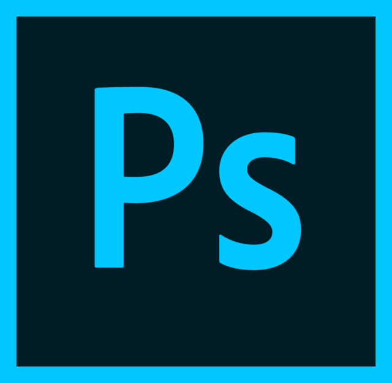

# ADOBE PHOTOSHOP

Es un editor de fotografías creado en 1986 por los hermanos Thomas Knoll y John Knoll, posteriormente desarrollado por la empresa Adobe Systems Incorporated. Como su nombre lo indica, Photoshop "taller de fotos" es usado principalmente para el retoque de fotografías y gráficos.

## Crear Ondas
* Creaun un objeto rectangulo
* Clic derecho, Deformar, Aplicar

