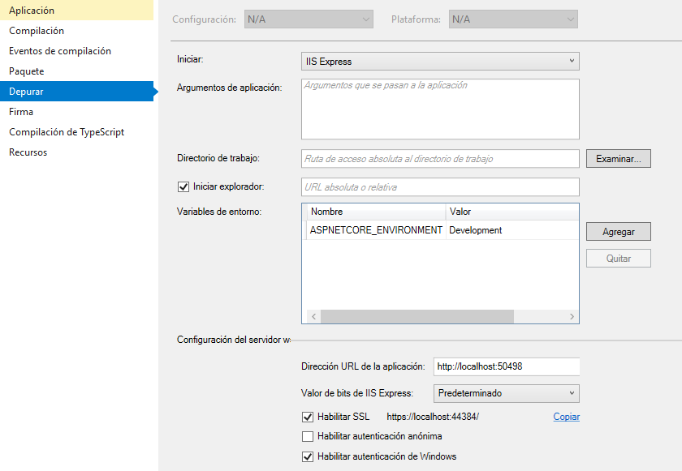

# ASP.NET CORE 2

## Instalación

1. Instalar [Microsoft Visual Studio](https://www.visualstudio.com/es/downloads/)
2. Instalar [Microsoft SQL Server](https://www.microsoft.com/es-xl/sql-server/sql-server-downloads)

3. Otra alternativa es instalar el [Microsoft .NET Core SDK 2.1](https://dotnet.microsoft.com/download/dotnet-core/2.1) y [Visual Studio Code]((https://code.visualstudio.com/)), ver [tutorial](https://docs.microsoft.com/en-us/aspnet/core/getting-started/?view=aspnetcore-2.2&tabs=windows)

4. Verificar la version del .NET Core Instalado, abrir la consola de comandos, cmd o terminal

```sh
dotnet --version
```

## Crear proyecto con Visual Studio

### Proyecto con autenticacion de usuarios individual

* Menu archivo, Nuevo Proyecto, c#, .NET Core, Aplicación Web ASP.NET Core, asignar nombre al proyecto, Aceptar
* Seleccionar aplicacion Web (Modelo-Vista-Controlador), Cambiar Autenticacion: Cuentas de Usuario Individuales, Aceptar

### Proyecto con autenticacion de usuarios de Windows

* Menu archivo, Nuevo Proyecto, c#, .NET Core, Aplicación Web ASP.NET Core, asignar nombre al proyecto, Aceptar
* Seleccionar aplicacion Web (Modelo-Vista-Controlador), Cambiar Autenticacion: Autenticación de Windows, Aceptar
* Configurar el Depurador: Menu Depurar, Propiedades WebAppName..



### Instalar Entity Framework

Es una tecnología desarrollada por Microsoft, que a través de ADO.NET genera un conjunto de objetos que están directamente ligados a una Base de Datos, permitiendo a los desarrolladores manejar dichos objetos en lugar de utilizar lenguaje SQL contra la Base de Datos.

* En el Explorador de Soluciones, clic derecho sobre Dependencias, Administrador de Paquetes NUGET
* En examinabuscar Microsoft EntityFrameworkCore, Instalar eligiendo la version del .Net Core (Ej. 2.1.1) lo siguiente:
    * Microsoft EntityFrameworkCore
    * Microsoft EntityFrameworkCore.Tools
    * Microsoft EntityFrameworkCore.SqlServer

### Configurar el DBContext

Sirve para generar tablas desde la aplicacion y definir que motor de base de datos se utilizara


