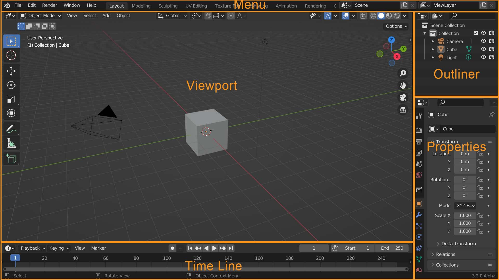

# MODELADO 3D CON BLENDER

Blender es un programa informático multiplataforma de distribución gratuita, dedicado especialmente al modelado, iluminación, renderizado, la animación y creación de gráficos tridimensionales.

## Bases para usar Blender
### Movimientos Básicos en el viewport

    Rueda del Mouse         Rotar el objeto en su eje
    Shift + Mouse           Mover la Vista    
    Cmd + Mouse             Acercar, Alejar objeto de la vista

### Trasnformaciónes

    Seleccionar objeto y presionar
    S - Escalar
    R - Rotación
    G - Posición o Localización

Un entorno 3D esta dividido en 3 ejes

    X - Rojo
    Y - Verde
    Z - Azul

Ejemplo:

    Desplazar el objeto en el eje X en 2 unidades

    Selec. Objeto, G + X + 2

### Las Ventanas

    Viewport        Es la ventana de objetos, luces,  camaras y modelos
    Outliner        Ventana de Jerarquia, lista de obejtos
    Properties      Esta ventana esta dividida en modulos: Herramientas, Escenas, Objetos etc.
    Time Line       Conjunto de Fotogramas

Crear una ventana

    Ir a la esquina superior de la ventana actual y mover
    Editor Type, seleccionar tipo de ventana

Eliminar Ventana

    Ir al medio de las dos ventanas
    clic derecho
    JOIN AREAS
    seleccionar la ventana que desaparecerá 

Modos de Vista en Viewport

    Activar menu        Z
    Modo Solid          Z, 6
    Modo Wireframe      Z, 4

*Agregar y Eliminar Objetos*

    Adicionar Objeto        Shift + A (se crean en la posicion del cursor 3D)
    Eliminar Objeto         Select Obj. + X, Delete (elegir object mode)

### Elementos del Modelando

Un modelo es la representacion matemática basada en coordenadas, compuesto por puntos en una posicion especifica, los puntos pueden ser los siguientes elementos:

* Vertices (Vertex)
* Borde ó Segmento (Edge)
* Caras ó Superficies (Face)

Fuente: https://www.youtube.com/watch?v=eFowqayoSKc

### El Menú de Modos

Menu Object Mode

    Object Mode         Seleccionar objetos, escalar, mover y rotar
    Edit Mode           Transformar libremente en base a vertices y superficies
    Sculpf Mode         Se puede esculpir como en plastilina
    Vertex Paint        Pintar sobre vertices
    Weight Paint        Pintado grueso sobre vertices
    Texture Paint       Pintar libremente sobre las superficies

    Ctrl + Tab          Navegar entre modos

Edit Mode, Aqui se puede hacer seleccion de:

    vertices (vertex)        1
    segmentos (Edge)         2
    caras (Face)             3

### Corte de un objeto

    Ctrl + R    Con el mouse fijar el eje (clic izq), mover el mouse para desplazar el corte
                Para generar varios cortes (rueda del mouse ó boton derecho trackpad)

### Extruccion

    Seleccionar objeto (ó varios objetos con Shift)

    Extrusion       E, mover con el mouse

### Unidades de Medida

    Ventana Properties          Units
                                Unit System = Metric
                                Units Scale = 0.1           (1)
                                Length = Centimeters        (Meters)

    Ventana Viewport            Show Overlays, Overlay
                                Scale = 0.1

### Unir Vertices

    Selecionar Vertices         Edit Mode, 1
    Rellenar vertices           F

### Reducir Poligonos

    Add Modificador             Decimate = 0.1
    Select all models           A
    Export Model                FBX format

### Localización y medidas del objeto

    Tab                 Cambiar entre modos Object y Edit
    N                   Transform, item (Objetc mode)
    Asignar medidas     Dimensions (X, Y, Z)
    Aplicar cambios     Ctrl + A, select transform
    Unidades de Medida  Menú lateral, Scene Properties, Units, Unit System (metrics), Length (mt, cm, mm)
    Mostrar medidas     Menú Overlays check Edge Length, Face Area
    Medir               Menu Herramientas, Messure (Ctrl = Iman)
    Medir en 3D         Menu Edit, Preferences, AddOns, buscar: 3D View Measureit
    Segmentos           N, View, Measureit Tools, Show-Hide
                        Seleccionar Vertices, Segment, Show

### Alinear Objetos y Centrar

    Crear Objeto                        Shift + A, objeto
    Posicionar Cursor 3D                N, View, (x=0, y=0, z=0)
    Posicionar Cursor 3D                Shift + rigth button mouse
    Apegar Cursor 3D sobre objeto       Shift + Right
    Activar menu circular               Shift + S
    Punto de Origen de un objeto        Ctrl + .
    Objeto al Punto de Origen           Context Menu (click right)
                                        Set Origen
                                        Geometry to Origen
### Modificadores

Adicionar Modificadores

    Properties Window
    Modifier Properties
    Add Modifier

*Mirror*

Espejo o replica de un objeto

    Mirror
    Axis: X
    Con la cuenta gota elegir el objeto de referencia
    Check Clipping, para que los vertices se apeguen al centro

Nota:   Todo objeto mirror en el eje deben estar cortados
        Se recomienda usar Mesh en Sculp Mode, para objetos que van pegados al eje

### Suavizados

*Subdivision Surface*

Interpolar entre vertices y caras

    Subdivision Surface

Aplicar Directamente

    Ctrl + 2

*Sombra suave*

    object mode
    select object
    right clic
    shade smooth

*sombra plana*

    object mode
    select object
    right clic
    shade flate

### Imagen de Referencia

Insertar imagen de referencia para modelado 3D

    Object Mode         Tab
    New Object          Shift + A
    Set frontal view    1
    Select Image        Add, Image, Reference
                        Set opacity 30% (Properties Image)
    Ver solo en X       Check Only Axis Aligned 
    
    Bloquear
    Transformacion      Object Property, Transformatio, block (cerrar candados)
    
### Fusionar Objetos con Union

    Frizar objetos              Object Mode, Ctrl + A, Apply, All Transformations
 
    Deshabilitar modificadores
    
    Cambiar modo de vista       Object Properties
    del obejto a unir           Viewport Display
                                Display as: Wire
    
    Seleccionar objeto base     Ctrl + L (para selecionar resto del objeto dado un elemento)

    Cambiar modo de vista       Object Mode (Tab)

    Add Modificador Booleano    Modifier Propierties, Add Modify, Boolean
                                Union
                                Objetc: Objeto a Unir
                                Apply

    Eliminar objeto unido       Select Objetc Wire, X, Delete    

*Nota:*     Se recomienda establecer triangulos en poligonos trapesoidales de cuatro vertices
            Usar recorte K
            Para cubrir un area del dibujo se recomienda tener como maximo 5 a 6 superficies  
    
### Unir y Separar Objetos

    Ctrl + J                    Unir objetos seleccionados
    L                           Seleccionar elementos adyacentes
    P                           Separar Objeto seleccionado

    Ctrl + L                    Selecionar el objeto entero dado un elemento

### Combinar Objetos

    Boolean                     Union
    Ctrl + J                    Unir Objetos

### Alinear vertices

    Shift + S
    Cursor to select        Alinear vertices
    Select vertex           Seleccionar vertices 
    S                       Escalar
    X                       Elegir eje X ()
    0                       Establecer tamaño en 0

    Shift + C               Cursos al Origen

### Soldar Vertices

    M
    Align Center
    ó
    Collapse

## Frizar Objeto

    Object Mode
    Select Object
    Ctrl + A
    Apply
    All Transformations
    N                       ITEM:
                            Location: 
                            X = 0, Y = 0, Z = 0
                            Rotation: 
                            X = 0, Y = 0, Z = 0
                            Scale:  
                            X = 1, Y = 1, Z = 1

    La geometria esta frizado, o quedo con valores normalizados
    
*Nota:* Este paso se hace cuando los modificadores no quieren funcionar

### Redondear seleccion de segmentos

    Activar Loop Tools          Menu Edit, Preferences, Add-Ons: Looptools
    Seleccionar segmentos
    Transformar en circulo      Click rigth, LoopTools, Circle

### Adherencia a Objetos (Snap)

    Menu head Viewport 3D, Active: Snap (Snap during transform)
    
    Definir objeto origen y objeto destino

    Snap:Incremet

### Puentes - Bridges (Conexiones entre objetos)

    Seleccionar dos grupos de edges (bordes)
    Click derecho
    Bridge Faces

    ó 

    LoopTools (habilitar con Add-Ons)
    Bridge

### Disolver segmentos

    Disolve

### Face Orientation

    Verificar la orientacion de las caras

    Objects Mode
    Menu Overlays
    Face Orientation Check

    Select Object
    Edit Mode               Tab
    Face Select             3
    Select Faces

    Mesh Menu
    Normals
    Flip                    Alt + N

### Hard Edge (Segmentos duros)

    Seleccionar segmentos
    Edit mode
    N
    Item
    Edges Data: Mean Crease = 1

## METODOS PARA EL MODELADO

Los métodos para el modelado pueden ser:

* Movimiento de Vertices
* Escultura
* Escaneo 3D

### METODO MOVIMIENTO DE VERTICES

Las Herramientas Principales para el Modelado de un Personaje mediante el método de Vertices son:

    Shift + A       Adicionar Objecto (Cube)
    Ctrl + R        Corte del objeto
    G               Mover
    S               Escalar
    R               Rotar
    E               Extruir
    E + S           Extruir y Escalar

    Subdivision     Suavizar Superficie (Apply para establecer division)
    Surface         
 
    Mirror          Duplicado de objeto
                    Axis = X (eje del mirror)
                    Mirror Objetc (Objeto de referencia del mirror)
                    Clipping check (las transformaciones no sobrepasan el eje)
    
    Ctrl + J        Fusionar objetos
    M + A           Fusionar vertices al centro

**NOTA:**

    Para modelado de personajes de juegos evitar muchas divisiones

**Modelado de un personaje**

Ejemplo 1

    Crear un Objeto                     Shift + A, Cube
    Centrar Objeto                      N, Locatio (0,0,0) (Object Mode)
    Edit Mode                           Tab
    Cortar Objeto (x)                   Ctrl + R
    Eliminar vertices (del Mirror)      X, Delete, Vertices
    Adicionar el modificador Mirror     Add Modifier, Mirror
    Mostrar/Ocultar Mirror              Mirror Optios, disable Realtime
    Hacer cortes y extruir
    Ad. el suavizador Subdivision       Add Modifier, Subdivision Surface
    Cambiar a modo de vista bordes      Viewport Shading Wireframe
    Seleccionar conjunto de vertices
    Cambiar a modo de vista solida      Viewport Shading Solid
    Habilitar recorte en Mirror         Mirror, check clipping
    Menu contextual sobre objeto
    Aplicar suavizado mejorado          Smooth vertices                  
                                        Se habilita un nuevo menu para personalizar suavizado
                                        Nota: verificar que este en modo seleccion de vertices
    Realizar cortes sobre objeto si
    el suavizado es brusco              Ctrl + R 

    Activar menu de modos de Vista      Z

Ejemplo 2

    Crear un Cubo                       Shift + A, Cube
    Suavizado Division Surface          Ctrl + 2
    Cambiar a Modo Edición              Tab
    Estirar la Esfera                   3 (selec. plano superior), G, Z, estirar en el eje Z
    Crear un corte                      Ctrl + R, desplazan en el eje z y darle forma al cuerpo
    Add un nivel de subdivision         Modifier Properties, Subdivision Suface, LevelVierport = 3
    Add objeto Cilindro                 Tab (Object Mode), Shift + A, Cylindre (vert=16)
    Ajustar el Cilindro                 Tab (Edit Mode), S, G, 3 (inferior cilindro), S
    Suavizado piso del cilindro         Eliminar superficie plana circular (X, delete, face)
                                        Seleccionar vertices (2, vertices)
                                        Escalar vertices (E, S) 2 veces, Alt M, para unir todo
                                        Suavizar (Ctrl + 2, Shade Smooth)

### Color y textura

1. Dividir Ventana
2. En Opcion Editor type, Elegir Shader Editor
3. Seleccionar Objeto
4. En submenu shading, habilitar viewport shading
5. En la ventana Shader Editor elegir Base Color, elegir color
6. Para definir mas colore o reutilizar en Properties elegir Material Properties, Browse material to inited ó Add material

### METODO ESCULTURA

    Interaction mode        Object Mode             
    Add Cube                Shift + A, Cube
    Subdivision surface     Ctrl + 3, Apply
    Interaction mode        Sculp Mode
    Simetria en ejes        Enable mesh symetry
    Tamaño de Pluma         F, mover
    
    Comando contrario a 
    la brocha               Ctrl + Brocha

    Suavizar geometria      Shift + Brocha

https://www.youtube.com/watch?v=ZuVGsJ1BAvo

## TIPS DE MODELADO 3D

*Selección*

    Tab                 Cambiar entre Edit Mode y Object Mode (Modos de Edicion)

    Shift               Seleccionar elementos individualmente
    Ctrl                Seleccionar el camino al elemento
    Alt                 Seleccionar en repetición (Loop)

    Ctrl +              Para que cresca la selección
    A                   Seleccionar todo
    A A                 Deseleccionar todo
    L                   Seleccionar un objeto independiente
    X                   Eliminar
    H                   Ocultar Objeto

    Edge + L            Selecciona todo el objeto dado el borde
    

    G                   Mover
    R                   Rotar
    S                   Escalar

    GG                  Modo slay (desplaz. paralelo al eje)
    
    Shift + G           Mover mas lento, etc
    G + X               Mover en el eje X, etc
    G + Z + 1           Mover en el eje Z en una unidad
    S + 0.5             Escalar en medio metro
    S + Shift + Z       Escalar en los ejes X,Y

    Alt + G             Vuelve a su posicion inicial (0, 0, 0)
    Alt + S             Recupera su escala original
    Alt + R             Vuelve a su rotacion inicial

    Shift + A           Adicionar objeto
    F2                  Asignar nombre al objeto

    N                   Mostrar menú transformación
    Z                   Submenu Viewport Shading (Modos de Vista)
    
    N, Tool
    Options
    Mirror: X           Activa la simetria (Mirror) en transformación

*Cursor*

    Shift + S           Submenu Cursor

*Recortar*

    Ctrl + R            Recortar

    Click Left          Establecer Corte
    Click Rigth         Establecer corte al centro

*Corte*

    J                   Join (Seleccionar vertices opuestos)

    K                   Corte libre y Enter para establecer el corte

    Alt + Z             Vista Transparente, Rayos X

*Duplicar*

    Shift + D           Duplicar seleccion
    P                   Establecer como objeto separado

*Union*

    Ctrl + J            Unir como un solo objeto (en Object Mode, seleccionar dos o mas objetos)

    Alt + J             Unir elementos (Faces)
    
    Click Right         Menu contextual
    Disolve Faces       Unir Caras

*Insertar*

    I                   Insertar (seleccionar vertices, mover con el mouse)

*Extruir*

    E                   Extruir

    E + S               Insertar escalado

*Rellenar*

    F                   Rellenar entre vertices seleccionados

*Bevel*

    Ctrl + B            Efecto Bisel, seleccionar bordes

    Ctrl + B + rueda    Adicionar niveles de Bevel

    Ctrl + Shift + B    Bevel en un vertice

*Dividir objeto en rombos*

    Shift + A           Adicionar Objeto
    UV Sphere           esfera
       Segments = 64
       Righs = 32
    Tab                 Edit Mode
    Edge Menu
       Un-Subdivide
       Iterations=1

*Reducir Poligonos*

    Ctrl + Click        Seleccionar borde intercalado
    Select Menu         Menu Viewport
    Select Loops        
    Edge Loops          

    Ctrl + X            Eliminar selecionado (se reduce poligonos sin perder la forma)
                        También se pueden eliminar vertices

## MODELADO 3D COMBINADO

    Unidad de medida        Scene Properties
                            Units
                            Unit System: Metric
                            Unit Scale = 0.1
                            Lenght = Centimeters

                            Viewport Overlays
                            Scale: 0.1                        

    Insertar imagenes       Shift + A, Images, References
    de referencia           Set opacity = 30% (Properties Image)
                            Check Only Axis Aligned 

    Insertar Objeto         Ctrl + A, Cube
    Suavizar                Ctrl + 3 (Subdivision Surface), Apply

    Esculpir                Sculp Mode
    Pluma                   Grab

    Tamaño de Pluma         F, mouse (Sculp Mode)
    
    Ajustar segun diseño

    Seleccionar objetos     A (Object Mode)
    Unir Objetos            Ctrl + J

    Fusionar Objetos        Sculp Mode   
    Unidos                  Remesh = 0.05

### Preparar modelo para imprimir

    Ctrl + A, Apply Transform         Aplicar Transformaciones
    Export (.stl)                   Exportar archivo a formaato STL
    check selection only            Exportar solo el objeto seleccionado
