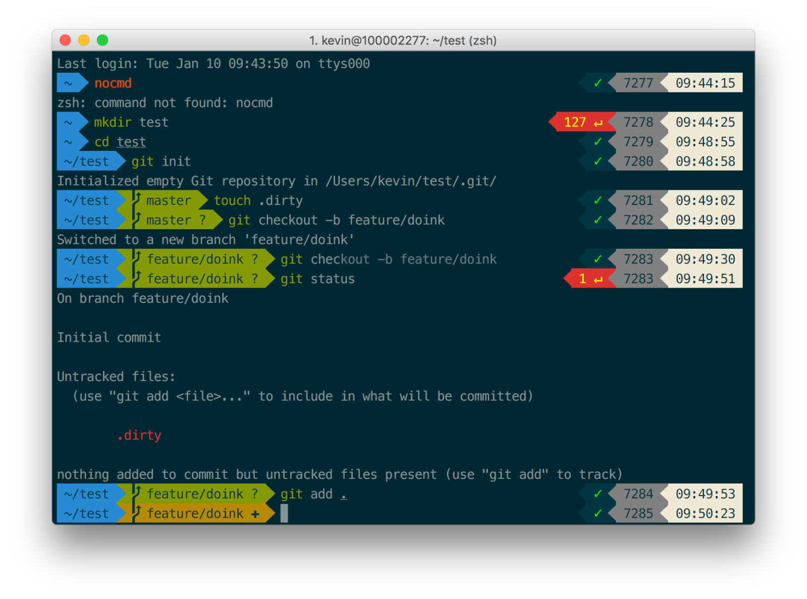
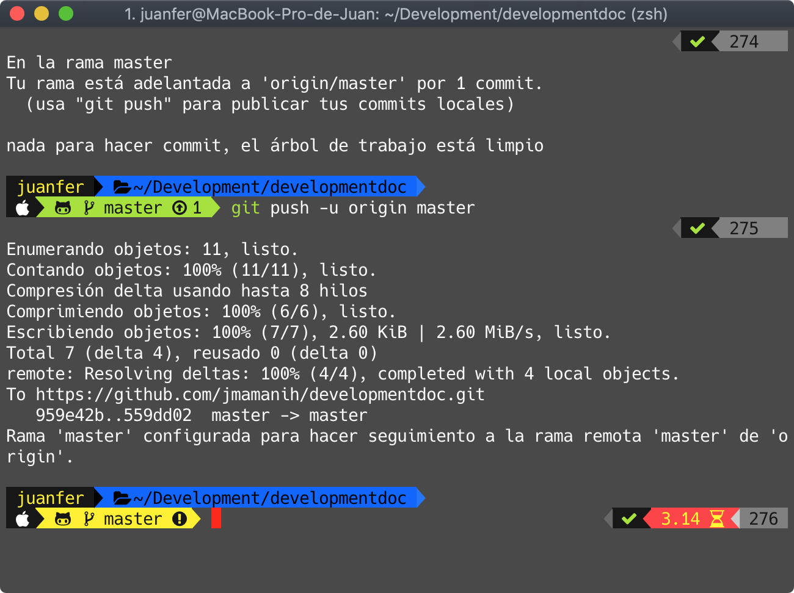

# Configure your macOs Terminal 



Tutorial: [Configuration Terminal Oh My Zsh](https://medium.freecodecamp.org/how-to-configure-your-macos-terminal-with-zsh-like-a-pro-c0ab3f3c1156)

Tutorial [Powerlevel9k](https://omrobbie.com/iterm2-oh-my-zsh-powerlevel9k-nerd-fonts-dimmed-monokai/)

## Oh My Posh

Configurar Terminal Personalizado para Windows [Oh My Posh](../Config_Terminal/OhMyPoshWindows.md)

https://www.youtube.com/watch?v=84e2R5nMLo8


## Install Homebrew

Install the CLI tools for Xcode.

```sh
xcode-select —-install
```

 Install Homebrew

 ```sh
/usr/bin/ruby -e "$(curl -fsSL https://raw.githubusercontent.com/Homebrew/install/master/install)"
 
 brew -v
 brew doctor
 brew search
 brew list
 brew install package_name
 brew remove package_name 
 ```
## Install iTerm2

```sh
brew cask install iterm2
```
## Install Git

```sh
brew install git
```

## Install ZSH

```sh
brew install zsh
```

## Install Oh My Zsh

```sh
sh -c "$(curl -fsSL https://raw.githubusercontent.com/robbyrussell/oh-my-zsh/master/tools/install.sh)"

zsh --version
```
Upgrade it to get the latest features of Zsh

```sh
upgrade_oh_my_zsh
```

## Change the Default Theme Oh My Zsh

Open the config file (.zshrc), 

```sh
nano ~/.zshrc
```

or

```sh
open ~/.zshrc
```

or 

```sh
vi ~/.zshrc
```

Edit:

```sh
ZSH_THEME="robbyrussell"
```

## Customizing iterm2 with ZSH and PowerLevel9k

[Tutorial](https://www.youtube.com/watch?v=pTW02GMeI74)

[Guide Github](https://gist.github.com/kevin-smets/8568070)

### Install PowerLevel9k

```sh
git clone https://github.com/bhilburn/powerlevel9k.git ~/.oh-my-zsh/custom/themes/powerlevel9k
```

Then edit your ~/.zshrc and set ZSH_THEME="powerlevel9k/powerlevel9k".

```sh
code ~/.zshrc
```

```sh
# ZSH_THEME="robbyrussell"
ZSH_THEME="powerlevel9k/powerlevel9k"
```

### Powerline fonts

[Guide](https://github.com/powerline/fonts)

```sh
# clone
git clone https://github.com/powerline/fonts.git --depth=1

# install
cd fonts
./install.sh

# clean-up a bit
cd ..
rm -rf fonts
```

### Install Patched Font

* Download [Source Code Pro](https://github.com/powerline/fonts/blob/master/SourceCodePro/Source%20Code%20Pro%20for%20Powerline.otf)

* Open the downloaded font and press "Install Font"

* Set this font in iTerm2 (14px is my personal preference) (iTerm → Preferences → Profiles → Text → Change Font →  Select Source Code Pro for Powerline

* Restart iTerm2 for all changes to take effect


Tmux usage include in ~/.zshrc

```sh
export TERM="xterm-256color"
```
### Visual Studio Code config

Installing a patched font 
To go to settings (CMD + ,) and add or edit the following values:

Default Font Family VS Code: "Menlo, Monaco, 'Courier New', monospace"

    for Source Code Pro: "terminal.integrated.fontFamily": "Source Code Pro for Powerline"
    for Meslo: "terminal.integrated.fontFamily": "Meslo LG M for Powerline"
    for other fonts you'll need to check the font name in Font Book.

You can also set the fontsize e.g.: "terminal.integrated.fontSize": 14


# Custom iTerm2 + Oh My Zsh + Powerlevel9k + Nerd Fonts + Scheme Monokai



[Guide Custom Terminal](https://omrobbie.com/iterm2-oh-my-zsh-powerlevel9k-nerd-fonts-dimmed-monokai/)

* Install Homebrew
```sh
/usr/bin/ruby -e "$(curl -fsSL https://raw.githubusercontent.com/Homebrew/install/master/install)"
```
* Install iTerm2
```sh
brew cask install iterm2
```
* Install Zsh
```sh
brew install zsh
```
* Install Oh My Zsh
```sh
    sh -c "$(curl -fsSL https://raw.githubusercontent.com/robbyrussell/oh-my-zsh/master/tools/install.sh)"
```
* Install Nerd Fonts

```sh
brew tap caskroom/fonts
brew cask install font-hack-nerd-font
```
Set this font in iTerm2 (iTerm → Preferences → Profiles → Text → Change Font →  Select Hack Nerd Font) and enable Non ASCII Font select Font: Hack Nerd Font.

* Download [Monokai Scheme](https://github.com/mbadolato/iTerm2-Color-Schemes/tree/master/schemes) for iTerm  (Copy Text, Save File as *.itemcolors)

Open iTerm2
Preferences → Profiles → Colors → Import → Select Monokai Scheme

* Install Powerlevel9k

```sh
git clone https://github.com/bhilburn/powerlevel9k.git ~/.oh-my-zsh/custom/themes/powerlevel9k
```

```sh
echo 'POWERLEVEL9K_MODE="nerdfont-complete"' >> ~/.zshrc
echo 'source  ~/.oh-my-zsh/custom/themes/powerlevel9k/powerlevel9k.zsh-theme' >> ~/.zshrc
```

* Modify file ~/.zshrc

```sh
code ~/.zshrc
```

To End File Add

```sh
POWERLEVEL9K_LEFT_PROMPT_ELEMENTS=(user ssh dir dir_writable newline os_icon vcs)
POWERLEVEL9K_RIGHT_PROMPT_ELEMENTS=(status command_execution_time root_indicator background_jobs history)
POWERLEVEL9K_PROMPT_ADD_NEWLINE=true
```
## Bonus
### Zsh Syntax Highlighting

```sh
brew install zsh-syntax-highlighting
echo 'source /usr/local/share/zsh-syntax-highlighting/zsh-syntax-highlighting.zsh' >> ~/.zshrc
```

### Zsh Auto Suggestions

```sh
brew install zsh-autosuggestions
echo 'source /usr/local/share/zsh-autosuggestions/zsh-autosuggestions.zsh' >> ~/.zshrc
```

