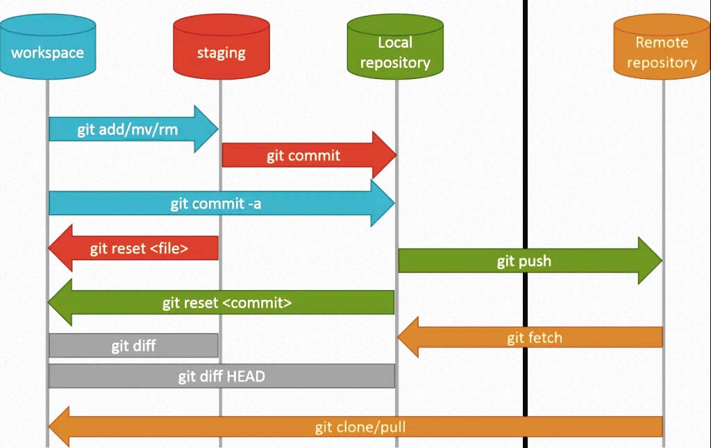
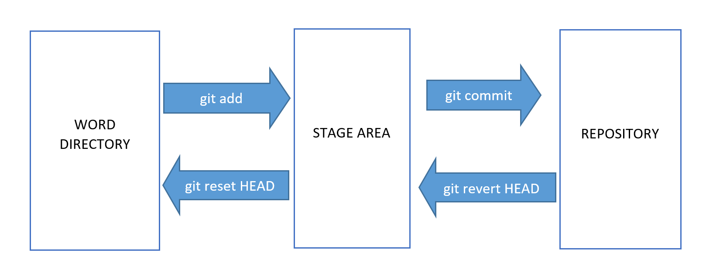

# GIT


Es un software de control de versiones diseñado por Linus Torvalds, pensando en la eficiencia y la confiabilidad del mantenimiento de versiones de aplicaciones cuando éstas tienen un gran número de archivos de código fuente. Su propósito es llevar registro de los cambios en archivos de computadora y coordinar el trabajo que varias personas realizan sobre archivos compartidos. 

<a id="topmenu">

* [Instalación de Git](#idsec10 "Instalación")
* [Repositorios Remotos](#idsec20 "Repositorios")
* [Comandos Git](#idsec30 "Comandos")
* [Casos prácticos de Git](#idsec40 "Guía práctica")
* [Solución de Errores](#idsec50 "Errores")

**Enlaces de Interes**
* [Versionamiento Semántico](https://semver.org/lang/es/)

<a id="idsec10">

## INSTALACION DE GIT

### Instalar Git en MacOSX

Install Xcode

```sh
xcode-select --install
```
Install Brew

```sh
/usr/bin/ruby -e "$(curl -fsSL https://raw.githubusercontent.com/Homebrew/install/master/install)"
brew -v
```

Install Git

```sh
brew install git
git --version
```


### Actualización de git en Mojave MacOs

```sh
xcode-select --install
brew install git
brew upgrade git
git --version
```


### Instalar Git en Windows 10

* Download [Git Bash for Windows](https://git-scm.com/download/win)
* Install GitBash


### Instalación de Git in Linux Debian

```sh
sudo apt-get update
sudo apt-get install git
sudo apt-get install -f
git --version
```

[ Ir al Inicio](#topmenu "Ir al Menu")

<a id="idsec20">

## Repositorios Remotos

* [Github](https://github.com/)
* [Sign in gitlab.com](https://gitlab.com/users/sign_in)

    Goto Project,  Goto Project, New Project

* [Bitbucket](https://bitbucket.org/)


## Clientes Git

* [Sourcetree](https://www.sourcetreeapp.com/)
* [Gitkraken](https://www.gitkraken.com/)
* [GitHub Desktop](https://desktop.github.com/)


[ Ir al Inicio](#topmenu "Ir al Menu")
<div id="idsec30">

## Comandos Git



### Configuración de Git

Como mínimo debemos configurar el nombre y el email en la aplicación con los siguientes comandos:

    git config --global user.name "Tu nombre aquí"
    git config --global user.email "tu_email_aquí@example.com"

### Crear un repositorio nuevo

Nos situamos en la carpeta en la que queremos trabajar. Nos aseguramos con pwd, para saber dónde estamos.

Ahora con git init y el nombre del proyecto, creamos un nuevo proyecto:

    git init 


### Trabajar en un proyecto existente con Git

Usamos Initializr para descargar un proyecto demo, lo ponemos en una carpeta, nos situamos en ella y ejecutamos simplemente git init.

    cd proyecto
    git cat > README.md
    git status

    git add README.md
    git commit -m “commit inicial”

También podemos hacer el add y el commit en un solo paso con:

    git commit -am “msj”
    git status


Se puede sacar un archivo del stage area con git reset HEAD y el nombre del archivo. 

    git reset HEAD README.md

Se puede descartar los cambios en el directorio de trabajo con checkout:

    git checkout -- README.md

Esto devuelve nuestro archivo readme al estado anterior.

    
### Ver el histórico de operaciones en Git.

    git log

Un ejemplo de una vista compacta y colorida sería:

    git log --oneline --graph --decorate --color

### Eliminar archivos del repositorio de Git

Imaginemos que uno de los archivos que ya están en el repositorio de git tras un commit no lo queremos allí. Podemos usar el comando rm de remove y el nombre del archivo:

    git rm intro.mp4


Podemos observar que el status nos indica que el cambio ejecutado para el archivo a eliminar está en el staging. Para eliminarlo debemos hacer un nuevo commit:

    git commit -m "archivo intro.mp4 eliminado"

### Ignorar archivos en Git

Crear y editar el archivo .gitignore, en el que se especifica los archivos a ignorar 

    nano .gitignore

Agregamos en la primera línea 

    *.log
    
Guardar y salir.

### Trabajando con Git en Repositorio Remoto

#### Configuración de una clave SSH y autenticación en GitHub

Lo primero es crear la autenticación SSH. 

* Nos dirigimos a la carpeta raíz de usuario
```
cd ~
pwd
```
* Creamos una carpeta llamada .ssh
```
mkdir .ssh
ls
```
* Nos movemos a ella y mediante el comando ssh-keygen creamos una clave asociada a la cuenta de correo, vamos a emplear una clave tipo RSA, de modo que el comando quedaría:

    Generar SSK-Key para GITHUB
    ```sh
    ssh-keygen -t rsa -b 4096 -C "jmamanihh@gmail.com"    
    ls -la
    ```
    El archivo .pub es la clave pública, que enviaremos a GitHub. Para ello debemos abrir el documento y copiar su contenido.

    cat ~/.ssh/id_rsa.pub  

* Iniciar sesion en GitHub y ir al menú principal, Settings, SSH and GPG Keys, New SSH Key.

    Title:  PC-Home
    Key: 
    ssh-rsa AAAAB3NzaC1yc2EAAAADAQABAAACAQDwv68knmFZUOllUK/+lepIpFenod7PH0IfkdEiVSWtk4MAqnQmFmoR9hHIaftCWdybzjOpqLp9Kjj/ngb77y0SyMNWUG3hKoTRuNJ1gjYiynNZJd/BKrDSKMAXn/Qdj8K3G6D2QBoIMtKXyyID9zcKkiB7nIZh7KsVqAjtIay+NF6mB/10PXFDRuKOQKyQguS9d7DuBJgTVDaHw8Rvk0yKVR7iI3e3dDLvzk2843gQi+rMeU6zDsevxuTY7KXYaS8vtFKL46lJYGr/cLtGUqkAGlaogCTpj7cyMT8TvuTmV8rHUiqLZBmRAMa85O9JXoDWonMafN6oiqml63iaMbi0OGnl30pz4HsE7DLETSg/q1PrmxIXyAEMV+YwCcJznJfI83sxwoer/mJUNT71AlkCd2+Yaicpv1KYOkP24TdaXjNHMVwTVawYusOsTcAVPb8x6PEvy662Kf4DI0VEDLFLIz0iiwNG4Sy2lpHxn0Zxgs9GuNBXsXCrAHCmQ9s+uy4iohk0xgj4CUdHki00bf9vYTdOw6hs84xGpopC1Xl5gTRAELQa64jKw95wJjQVSZSWktN9mDh4ycJnmNldQuMuIMardPBe5SRwbqY4XVDctZI2HyOGJC2nm/WHWg19c79rgm6AmjI5HaDrNyY0v0Ci80XcJWrG5wBx1anMsyLG0Xw== jmamanihh@gmail.com

* Realizar operaciones de push y pull para comprobar


### Trabajando con un repositorio remoto en GitHub

Primero se debe crear un nuevo repositorio desde la aplicación web de GitHub con la sesión iniciada, <https://github.com/>.

    Descrption:  Nombre del repositorio
    Type:  []Public]   or [Private], seleccionar de acuerdo al uso del repositorio
    Readme:  Seleccionar si el repositorio tendra un archivo READEM.md

Una vez creado, en la siguiente pantalla hacemos clic en SSH en la parte superior para ver las instrucciones de envío mediante línea de comandos.

    echo "# demo-git" >> README.md
    git init
    git add README.md
    git commit -m "Initial commit"
    git remote add origin git@github.com:usuario/demo.git
    git push -u origin master


Ahora nos movemos al proyecto con el que queremos trabajar. Vemos que el status no hay nada pendiente y ejecutamos el primer comando. Usando después…

    git remote -v

El comando remote sirve para ver los repositorios remotos asociados. con la opción -v vemos la URL:

Agregar repositorios de otros usuarios para recibir con el comando git remote add [nombre] [url].

    git remote add pb git://github.com/paulboone/ticgit.git

Recibir los ficheros de uno de estos repositorios de otro usuario usamos el comando fetch seguido del nombre que hemos puesto en el comando anterior.

    git fetch pb

Enviar los archivos en local al repo remoto con push y la opción -u para establecer un enlace entre ellos, especificando también el repositorio remoto (origin) y la rama de trabajo (master), quedando:

    git push -u origin master

Una vez establecido el enlace no hará falta usar la opción -u, quedando la instrucción para actualizar los cambios en el repositorio remoto de la siguiente manera:

    git push origin master


Solicitar los últimos cambios mediante un pull, antes de enviar los nuestros con push, para evitar conflictos con otros miembros del equipo. De modo que ejecutamos:

    git pull origin master

    git push origin master

Al hacer pull, el sistema recupera y trata de unir la rama remota con la local, mientras que con el comando fetch que veíamos antes no.


### Especificar versiones en Git con tag

Git tiene la posibilidad de marcar estados importantes en la vida de un repositorio, algo que se suele usar habitualmente para el manejo de las releases de un proyecto. A través del comando "git tag" podemos crear etiquetas, en una operación que se conoce comúnmente con el nombre de "tagging". Es una operativa que tiene muchas variantes y utilidades, nosotros veremos las más habituales que estamos seguros te agradará conocer. 

**Numeración de las versiones**

Generalmente los cambios se pueden dividir en tres niveles de "importancia": Mayor, menor y pequeño ajuste. Si tu versión de proyecto estaba en la 0.0.1 y haces un cambio que no altera la funcionalidad ni la interfaz de trabajo entonces lo adecuado es versionar tu aplicación como 0.0.2. Si el proyecto ya tiene alguna ampliación en funcionalidad, pero sigue manteniendo completa compatibilidad con la versión anterior, entonces tendremos que aumentar el número de enmedio, por ejemplo pasar de la 1.0.0 a la 1.1.0. Ahora bien, si los cambios introducidos en el proyecto son tales que impliquen una alteración sobre cómo se usará esa aplicación, haciendo que no sea completamente retrocompatible con versiones anteriores, entonces habría que aumentar en 1 la versión en su número más relevante, por ejemplo pasar de la 1.1.5 a la 2.0.0. 

**Crear un tag con Git**

    git tag v0.0.1 -m "Primera versión"

**Ver los estados de las versiones**

    git tag

**Ver estados de las versiones**

Otro comando interesante en el tema de versionado es "show" que te permite ver cómo estaba el repositorio en cada estado que has etiquetado anteriormente, es decir, en cada versión.

    git show v0.0.2

**Enviar tags a GitHub***

Si quieres que tus tags creados en local se puedan enviar al repositorio en GitHub, puedes lanzar el push con la opción --tags. Esto es una obligatoriedad, porque si no lo colocas, el comando push no va a enviar los nuevos tags creados.

    git push --tags

En concreto la opción --tags, tal cual la hemos usado, envía todas las nuevas tag creadas, aunque podrías también enviar una en concreto mediante la especificación de la que quieres enviar, tal como se puede ver en el siguiente comando.

    git push origin v0.0.4

En este caso debemos especificar qué repositorio remoto es el destino de las tags que acabamos de crear ("origin" en este caso), pues si no se especifica el comando entenderá que el nombre de nuestro tag es el nombre del repositorio remoto que estamos queriendo usar para enviar los cambios locales, lo que nos dará un error.
Nota: Aparentemente, la opción --tag hace el mismo efecto que --tags. Las dos envían los tags que tengamos en local al repositorio remoto. Por eso puedes probar usar ambas, aunque en la documentación de Git usan siempre --tags.

    git push --tag

Enviar tags y hacer push de los commits al mismo tiempo

Solo un pequeño detalle relativo al comando push cuando lo usamos para enviar tags. Cuando en el comando push usamos la opción --tags en principio no se mandan los cambios que tengamos en el repostiorio. Es decir, aunque hayamos hecho cambios en la rama master y se hayan realizado los correspondientes commits en local, si lanzamos "git push --tags", únicamente los nuevos tags se van a enviar a remoto. No se enviarán los commits que se hayan podido realizar en cualquier rama.

Si queremos hacer un push de una rama en concreto, por ejemplo la rama master, y enviar los tags al mismo tiempo, entonces podríamos lanzar el siguiente comando.

    git push origin master --tags


[ Ir al Inicio](#topmenu "Ir al Menu")
<div id="idsec40">

## CASOS PRACTICOS CON GIT

### Configuración Inicial de Git 

Get Configuration Information

    git config --list

Get Repository Remote Information

    git remote -v

Git global configuration 

    git config --global user.name "Juan Fernando Mamani Huayhua"
    git config --global user.email "jmamani.bo@gmail.com"


Git config proxy local (or global use --global)

    cd project
    git config --list 
    git config http.proxy http://127.0.0.1:3122
    git config https.proxy https://127.0.0.1:3122
    git config --list

To unset config proxy

    git config --unset http.proxy
    git config --unset https.proxy

Enable public key in remote repository

```sh
ssh-keygen -t rsa -C "jmamani.bo@gmail.com"
    Enter file name default (id_rsa):
    Enter passphrase: ********
cat ~/.ssh/id_rsa.pub
```

Add Key in repository (Gitlab)
    
    * Sign in Gitlab
    * Goto Menu Settings, SSH Keys
        Key: Copy the previously generated key
        Title: Computer name
    * Add Key


#### Git Project Init

    mkdir project_name
    cd project_name
    git init
    touch README.md
    touch INSTALL.md
    git add .
    git commit -m "Initial Commit"
    git push -u origin master

#### Configuración ideal para .gitignore

```vb
# ignore log files and databases
*.log
*.sql
*.sqlite

# ignore compiled files
*.com
*.class
*.dll
*.exe
*.o
*.so

# ignore packaged files
*.7z
*.dmg
*.gz
*.iso
*.jar
*.rar
*.tar
*.zip

# ignore OS generated files
ehthumbs.db
Thumbs.db
.DS_Store
.DS_Store?
._*
.Spotlight-V100
.Trashes

# ignore Editor files
*.sublime-project
*.sublime-workspace
*.komodoproject
_ide_helper.php
/.idea
/.vscode

# Eclipse project files
.buildpath
.project
.settings/

# Ignore cache
.cache/

# Ignore user created files :)
*.bak
*.orig

# Ignore system files
.bash_history
LICENSE_AFL.txt
LICENSE.html
LICENSE.txt
LICENSE_EE*
RELEASE_NOTES.txt
.ssh/
error_log
.htpasswds
/.htaccess
php.ini.sample
.modgit/
_vti_bin/
_vti_cnf/
_vti_inf.html
_vti_log/
_vti_pvt/
_vti_txt/
tmp/
php.ini
_old/
.htpasswds/
.htpasswd
.viminfo
.profile
.bashrc
.bash_logout
.bash_history
.modgit/
.modman/
pkginfo
nohup.out
Homestead.yaml
Homestead.json
/.vagrant
.phpunit.result.cache

#Laravel Specific files
/node_modules
/public/hot
/public/storage
/storage/*.key
/vendor
.env
.env.backup
.phpunit.result.cache
docker-compose.override.yml
Homestead.json
Homestead.yaml
npm-debug.log
yarn-error.log
```
Enlasar al repositorio remoto

```sh
git remote add origin https://github.com/jmamanih/lapazdigitallab.git
git add .
git commit -m "Initial Commit"
git status
```

#### Init Commit in Clone Projects

Init Commit to remote repository

    cd project_folder
    git init
    git remote add origin git@gitlab.com:jmamani.bo/development_info.git
    git add .
    git commit -m "Initial commit"
    git push -u origin master


Clone Projet from Gitlab


    cd folder_projects
    git clone git@gitlab.com:jmamani.bo/development_info.git
    cd development_info
    touch README.md
    git add README.md
    git commit -m "add README"
    git push -u origin master


Enabled autentication SSH

    git config --global http.sslVerify false    


#### Create New Repository (Github)

    echo "# lapazdigital" >> README.md
    git init
    git add README.md
    git commit -m "first commit"
    git remote add origin https://github.com/jmamanih/lapazdigital.git
    git push -u origin master


**create a new repository on the command line**

    echo "# project name" >> README.md
    git init
    git add README.md
    git commit -m "first commit"
    git branch -M main
    git remote add origin https://github.com/jmamanih/project_name.git
    git push -u origin main

**push an existing repository from the command line**

    git remote add origin https://github.com/jmamanih/project_name.git
    git branch -M main
    git push -u origin main

#### Push Exsiting Repository (Github)

    git remote add origin https://github.com/jmamanih/lapazdigital.git
    git push -u origin master

#### Branching Operations

Show information remote data

    git remote show origin

Get remote repository current

    git remote get-url origin

Change the remote repository

    cd project
    git remote -v
    git remote rm origin
    git remote add origin git@gitlab.geo.gob.bo:agetic/asamblea-legislativa-backend.git


Retrieve remote project data

    git fetch origin


Import branches from remote repository

    git branch -a

To move on a branch

    git checout branch_name
    git branch
    ls -l

Create new branch

    git branch new-branch


Move to new branch

    git checkout new-branch

Create and move to a new branch

    git checkout -b new-branch


Show local branches

    git branch


Show remotes branches

    git branch -a


Delete branch

    git branch -d rama

Update changes to repository

    git add .
    git commit -m "Descriptive text of changes"
    git fetch origin branch_name
    git pull origin branch_name
    git push origin branch_name

Force upload to widely different content repository

    git add .
    git commit -m "Message different content"
    git push origin +rama

Apply all commits to another branch

    git checkout master
    git merge new_branch
    git branch diff new_branch


Branch update forcefully

    git reset --hard origin/branch_name
    git pull origin branch_name

Upload changes to another branch

    git fetch origin
    git branch -a
    git checkout new_branch
    git checkout branch_name
    git push orgin new_branch
    git checkout branch_name

#### Work directory, Stage Area and Repository



List commits

    git log

    git log --oneline | cat

    git log --oneline --decorate


Git status

    git status


Send file to stage

    git add .

    git add <filename>

To unstage 

    git reset HEAD <file>...


To send Repository

    git commit -m "message"

Undo last change (in working directory)

    git checkout -- <filename>

Recovery file deleted 

    git checkout -- "Angular/03 Angular 4.md"

Fix corrupted git repository

    mv -v .git .git_old &&            
    git init                       
    git remote add origin "http://git..." 
    git fetch                      
    git reset origin/master --mixed 

[ Ir al Inicio](#topmenu "Ir al Menu")
<div id="idsec50">

**create a new repository on the command line**

```sh
echo "# developmentdocs" >> README.md
git init
git add README.md
git commit -m "first commit"
git branch -M main
git remote add origin git@github.com:jmamanih/developmentdocs.git
git push -u origin main
```

**push an existing repository from the command line**

```sh
git remote add origin git@github.com:jmamanih/developmentdocs.git
git branch -M main
git push -u origin main
```

---

## SOLUCION DE ERRORES

### BUG FIX
[1]
Error:
```
# git push -u origin master

Permission denied (publickey).
fatal: Could not read from remote repository.

Please make sure you have the correct access rights
and the repository exists.
```

Solution:

```
$ git remote -v
$ git config --get remote.origin.url
$ GIT_SSL_NO_VERIFY=true git push origin -u master
  Username for 'https://gitlab.geo.gob.bo': juan.fernando.mamani
  Password for 'https://juan.fernando.mamani@gitlab.geo.gob.bo': *****
```

[2]

### Git Enter passphrase
Message:
```
Enter passphrase for key '/Users/juanfer/.ssh/id_rsa':
```
Solution:
```
ssh-add ~/.ssh/id_rsa
```

[ Ir al Inicio](#topmenu "Ir al Menu")


### Error 403

Generar un nuevo Token

```sh
Menu Perfil Github, 
    Settings,
    Developer settings
    Personal Access Token,
    Tokens (Classic)

    Generate New Token, Generate New Token (Classic)

        Note:  Nombre de Usuario
        Expiration: No expiration
        chackbox Repo
        Generate Token

    Copy Token

    Al subir al repositorio en vez de password copiar el token
    
```