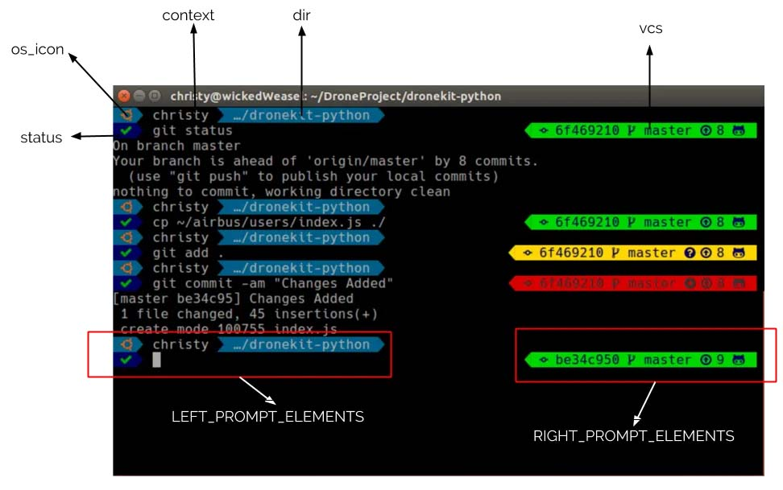

# LINUX MINT - INSTALL TOOLS DEVELOPER


Linux Mint es una distribución de Linux basada en la comunidad basada en Debian y Ubuntu que se esfuerza por ser un "sistema operativo moderno, elegante y cómodo que sea potente y fácil de usar"


*Obtener version de Linux Mint*

```sh
hostnamectl
```
```sh
lsb_release -a
```
```sh
cat /etc/os-release
```

*Actualizar Sistema*

```sh
sudo apt-get update
sudo apt-get upgrade
sudo apt-get dist-upgrade
sudo apt-get --fix-broken install
```

## Instalar Herramientas de Virtualización

*Parallels Tools*

```sh
Menu Acciones, Instalar Paralles Tools
En linux abrir CD y ejecutar install-gui
reiniciar sistema: shutdown -h now
```

## Instalar JDK 

Instalar JDK 17

```sh
sudo apt-update
sudo add-apt-repository ppa:linuxuprising/java
        intro
sudo apt-update
sudo apt install oracle-java17-installer --install-recommends
        Y
        arrow down
        Ok
        Yes
java --version
```

## Instalar Apache Maven

Instalar mvn

```sh
sudo apt install maven
        Y
mvn -version
```

## Instalar Visual Studio Code

Descargar el archivo .deb del sitio [Visual Studio Code](https://code.visualstudio.com/)

Instalar Visual Studio Code

```sh
cd ~
sudo dpkg -i Descargas/code_1.85.1-1702462158_amd64.deb
```

Abrir Visual Studio Code

```sh
code .
```

Desinstalar Visual Studio Code

```sh
sudo apt-get remove code
```

## Instalar InntelliJ IDEA Community Edition

Descargar el archiv .tar.gz del sitio [IntelliJ CE](https://www.jetbrains.com/idea/download/other.html)


Instalar IntelliJ IDEA CE

```sh
sudo tar -xzvf ideaIC-2023.3.2.tar.gz -C /opt
cd /opt
ls
cd idea-IC-233.13135.103/bin
./idea.sh 
```

Crear Acceso directo de IntelliJ IDE CE

```sh
Options Menu > Create Desktop Entry
    check: Create the entry for all users
    password: root
```

## Instalar Postgres

Instalar Postgres

```sh
sudo apt-get update
sudo apt install postgresql postgresql-contrib
psql --version
```

Ingresar a la linea de comandos Postgres

```sh
sudo su - postgres
psql
        \l              # listar bases de datos
        \q              # salir
```

Crear un super usuario de la base de datos (prueba)

```sh
create user prueba with password '12345';
create database db_prueba with owner prueba;
alter user prueba with superuser;
```

Intalación de pgadmin

```sh
sudo curl https://www.pgadmin.org/static/packages_pgadmin_org.pub | sudo apt-key add

sudo sh -c '. /etc/upstream-release/lsb-release && echo "deb https://ftp.postgresql.org/pub/pgadmin/pgadmin4/apt/$DISTRIB_CODENAME pgadmin4 main" > /etc/apt/sources.list.d/pgadmin4.list && apt update'

sudo apt install pgadmin4
```

Cambiar contraseña postgres
```sh
sudo su - postgres
psql
        \password postgres              # cambiar contraseña del usuario postgres
        \q                              # salir
```
## Instalar Gestor de Base de Datos (DBeaver)

Descargar el archivo .deb del sitio [DBeaver](https://dbeaver.io/download/)

Instalar DBeaver

```sh
cd ~
sudo dpkg -i Descargas/code_1.85.1-1702462158_amd64.deb
```

Cambiar a modo oscuro

```sh
Menu Ventana > Preferencias > User Interface > Aspecto
    Tema: Dark
    Aplicar y Cerrar
```

## Instalar Git

Instalar Git

```sh
sudo apt update
sudo apt install git
git --version
```


## Instalar Terminal (Terminator)

Instalar Terminator

```sh
sudo apt update
sudo apt install terminator
terminator --version
terminator
```

# Instalar y usar Zsh con Oh-My-Zsh

1. Actualizar el Sistema

```sh
sudo apt update
sudo apt install wget curl git -y
```

2. Instalar Zsh

```sh
sudo apt install zsh -y
zsh --version
```

3. Cambiar a Zsh Shell

```sh
sudo chsh -s /usr/bin/zsh $USER
echo $SHELL
```

4. Instalar Oh-My-Zsh

```sh
sudo apt install wget git
wget https://github.com/robbyrussell/oh-my-zsh/raw/master/tools/install.sh -O - | zsh
```

5. Crear un archivo de configuración para Zsh 

```sh
cp ~/.oh-my-zsh/templates/zshrc.zsh-template ~/.zshrc
source ~/.zshrc
```


6. Cambiar el tema predeterminado de Zsh 

Comprobar temas disponibles por defecto esta 'robbyrusell'

```sh
cd ~/.oh-my-zsh/themes/
ls -a
```
```sh
vim ~/.zshrc
```
```sh
    ZSH_THEME=”risto”
```
```sh
source ~/.zshrc
```
7. Habilitar los complementos Oh-My-Zsh

Verificar los complementos disponibles

```sh
cd ~/.oh-my-zsh/plugins/
ls -a
```
Se pueden habilitar diferentes complementos editando el archivo de configuración .zshrc.
Abrir .zshrc con el editor favorito y buscar el parámetro plugins=().

```sh
vim ~/.zshrc
plugins=(git extract web-search yum git-extras docker vagrant)
```

## Instalar Tema Powerlevel10k para Oh my Zsh

*Editar: ~/.zshrc*

```sh
ZSH_THEME="agnoster"
```

Ver cambios

```sh
source ~/.zshrc
```

Instalar Fonts para linea de comando

```sh
sudo apt-get install fonts-powerline
```

Para ver cambios de los fonts, cerrar Terminal y volver a abrir

*Install powerlevel9k para Oh my zsh*

```sh
git clone https://github.com/bhilburn/powerlevel9k.git ~/.oh-my-zsh/custom/themes/powerlevel9k
```

Editar el archivo ~/.zshrc

```sh
export TERM="xterm-256color"

ZSH_THEME="powerlevel9k/powerlevel9k"
```

Refrescar Terminal Shell

```sh
source ~/.zshrc
```

*Personalizar powerlevel9k*

Instalar Nerd-Fonts

Descargar Hack Nerd fonts de [Nerd-Fonts](https://www.nerdfonts.com/font-downloads)

Descomprimir

```sh
unzip Hack.zip -d Fonts 
```

Copiar al directorio fonts

```sh
sudo cp Fonts/HackNerdFont-Regular.ttf /usr/share/fonts 
fc-cache -fv
```

Abrir terminal y establecer como fuente predeterminada Nerd-Font

```sh
Abrir terminator, clic derecho
Preferencias > Perfiles > Default > Tipografia: Hack Nerd Font Regular, 12 
```

Personalizar Colores de la Terminal (Terminator)



Editar el archivo ~/.zshrc

```sh
vim ~/.zshrc
```
```sh
ZSH_THEME="powerlevel9k/powerlevel9k"

POWERLEVEL9K_MODE='nerdfont-complete'

POWERLEVEL9K_LEFT_PROMPT_ELEMENTS=(os_icon context dir newline status)
POWERLEVEL9K_OS_ICON_FOREGROUND=202
POWERLEVEL9K_OS_ICON_BACKGROUND=025
POWERLEVEL9K_CONTEXT_TEMPLATE='%n'
POWERLEVEL9K_CONTEXT_DEFAULT_FOREGROUND=019
POWERLEVEL9K_CONTEXT_DEFAULT_BACKGROUND=034
POWERLEVEL9K_DIR_HOME_FOREGROUND=017
POWERLEVEL9K_DIR_HOME_SUBFOLDER_FOREGROUND=215
POWERLEVEL9K_DIR_ETC_FOREGROUND=249
POWERLEVEL9K_DIR_DEFAULT_FOREGROUND=017
POWERLEVEL9K_DIR_HOME_BACKGROUND=039
POWERLEVEL9K_DIR_HOME_SUBFOLDER_BACKGROUND=024
POWERLEVEL9K_DIR_ETC_BACKGROUND=024
POWERLEVEL9K_DIR_DEFAULT_BACKGROUND=024
POWERLEVEL9K_SHORTEN_DIR_LENGTH=1
#POWERLEVEL9K_HOME_ICON=''
#POWERLEVEL9K_HOME_SUB_ICON=''
#POWERLEVEL9K_FOLDER_ICON=''
POWERLEVEL9K_STATUS_VERBOSE=true
POWERLEVEL9K_STATUS_CROSS=true
POWERLEVEL9K_STATUS_OK_FOREGROUND=220
POWERLEVEL9K_STATUS_OK_BACKGROUND=020
POWERLEVEL9K_STATUS_ERROR_BACKGROUND=017
POWERLEVEL9K_RIGHT_PROMPT_ELEMENTS=(vcs)
POWERLEVEL9K_VCS_CLEAN_FOREGROUND=017 # navyblue
POWERLEVEL9K_VCS_CLEAN_BACKGROUND=040 # green3a
POWERLEVEL9K_VCS_UNTRACKED_FOREGROUND=017 # navyblue
POWERLEVEL9K_VCS_UNTRACKED_BACKGROUND=220 # gold1
POWERLEVEL9K_VCS_MODIFIED_FOREGROUND=236 #grey19
POWERLEVEL9K_VCS_MODIFIED_BACKGROUND=160 #red3a
POWERLEVEL9K_SHOW_CHANGESET=true
```

Nota: Los códigos de colores  paleta de colores estan en [paleta de colores](https://myangpow.com/colors-of-digital-screen/)

## Instalar plugins (zsh-autosuggestions and zsh-syntax-highlighting)

Descargar zsh-autosuggestions

```sh
git clone https://github.com/zsh-users/zsh-autosuggestions.git $ZSH_CUSTOM/plugins/zsh-autosuggestions 
```

Descargar zsh-syntax-higlighting

```sh
git clone https://github.com/zsh-users/zsh-syntax-highlighting.git $ZSH_CUSTOM/plugins/zsh-syntax-highlighting
```

Editar el archivo ~/.zshrc
encontrar plugins=(git) y reemplazar por
```sh
plugins=(git zsh-autosuggestions zsh-syntax-highlighting)
```
Reabrir terminal

Nota: si al abrir la terminal abre por defecto p10k configure se puede inhabilitar con el siguiente comando:

```sh
echo 'POWERLEVEL9K_DISABLE_CONFIGURATION_WIZARD=true' >>! ~/.zshrc    
```


## Instalar Vim

```sh
sudo apt update
sudo apt install vim
```

## Instalar Tmux

Instalar Tmux

```sh
sudo apt update
sudo apt install tmux
tmux
tmux -V
```

Ver comandos [Tmux](/Tmux/Tmux.md)