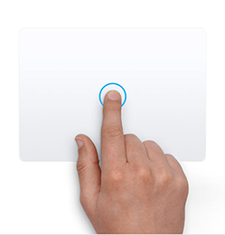
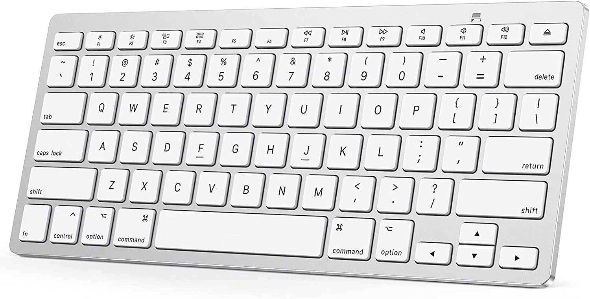

# Gestos y Atajos para el Trackpad, Mouse, Finder y otras funciones de macOS


## Gestos para el Trackpad



Hay que empezar por lo más básico, que son gestos que puede usar en el trackpad para realizar diversas acciones sin tener que abrir menús o usar el teclado. Estos gestos van desde gestos simples como tocar para hacer clic hasta otros gestos con varios dedos:

```sh

- Pulsar con un dedo: una pulsación o clic.

- Pulsar con dos dedos: clic derecho.

- Pulsar dos veces con dos dedos: zoom inteligente, ampliando o reduciendo el zoom de una web.

- Deslizar dos dedos hacia arriba o abajo: desplazarse por una web o una página, moviéndola hacia arriba o hacia abajo.

- Pellizcar con dos dedos: aumentar o reducir el zoom dependiendo de si pellizcas hacia afuera o hacia adentro.

- Mover dos dedos uno alrededor del otro: es el gesto de rotación, para girar fotos o elementos.

- Deslizar dos dedos hacia la izquierda o derecha: deslizar página, y dependiendo de hacia qué lado deslices los dedos irás a la página siguiente o la anterior.

- Deslizar dos dedos hacia la izquierda desde el borde derecho: mostrar el centro de notificaciones.

- Arrastrar con tres dedos: mover un elemento a la pantalla. Luego hacer pulsación para soltar.

- Pulsar con tres dedos: búsqueda y detección de datos. Con el gesto, buscará una palabra o realizar una acción con fechas, direcciones, números de teléfonos u otros datos.

- Separar el pulgar y tres dedos: esta especie de pellizco hacia afuera con varios dedos se muestra el escritorio.

- Pellizcar con el pulgar y tres dedos: este pellizco con varios dedos se muestra el Launchpad.

- Deslizar hacia arriba con cuatro dedos: abrir el Mission Control.

- Deslizar hacia abajo con cuatro dedos: mostrar todas las ventanas de la app que estás utilizando.

- Deslizar hacia la izquierda o derecha con cuatro dedos: cambiar de un escritorio a otro y alterna entre apps a pantalla completa.
```

## Gestos para el Mouse


Recopilación de otros gestos, en este caso realizándolos con el touchpad de Apple. Por lo tanto, estos son gestos que requieren que se use un Magic Mouse o una alternativa compatible:

```sh

- Pulsar en el lado izquierdo: clic izquierdo o clic normal.

- Pulsar en el lado derecho: clic derecho.

- Deslizar un dedo hacia arriba o abajo: se desplazará por la página en la que está, deslizándola hacia arriba o hacia abajo.

- Pulsar dos veces con un dedo: zoom inteligente, ampliando o reduciendo el zoom de una web.

- Pulsar dos veces con dos dedos: se abrir Mission Control.

- Deslizar dos dedos hacia la izquierda o derecha: cambiar de un escritorio a otro y alternar entre apps a pantalla completa.

- Deslizar un dedo hacia la izquierda o derecha: deslizar página, y dependiendo de hacia qué lado deslice los dedos irás a la página siguiente o la anterior.
Gestos en un Magic Mouse de Apple. (foto: MuyComputer)
```

## Atajos de teclado



### Atajos de teclado para el Finder

```sh

- ⌘ + D: duplicar los archivos que se tenga seleccionado.

- ⌘ + E: expulsa el disco o el volumen seleccionado.

- ⌘ + F: abrir Spotlight para buscar contenido dentro de la ventana del Finder.

- ⌘ + I: se muestra la ventana de información del archivo que se tenga seleccionado.

- ⌘ + R: tiene varios usos. Cuando hay un alias seleccionado se muestra su archivo original. En algunas apps como el calendario o el navegador se actualiza la información. También se recarga la comprobación de si hay actualizaciones en la pantalla de Actualización de software

- Mayúsculas + ⌘ + C: abrir la ventana Equipo.

- Mayúsculas + ⌘ + D: abrir la carpeta Escritorio.

- Mayúsculas + ⌘ + F: abrir la ventana Recientes.

- Mayúsculas + ⌘ + G: abrir la ventana Ir a la carpeta.

- Mayúsculas + ⌘ + H: abrir la carpeta de inicio de la cuenta del usuario que se esté usando.

- Mayúsculas + ⌘ + I: abrir la carpeta de iCloud.

- Mayúsculas + ⌘ + K: abrir la ventana Red.

- Mayúsculas + ⌘ + L: abrir la carpeta Descargas.

- Mayúsculas + ⌘ + N: crear una nueva carpeta dentro del Finder.

- Mayúsculas + ⌘ + O: abrir la carpeta de Documentos.

- Mayúsculas + ⌘ + P: abrir o cerrar el panel de vista previa en las ventanas.

- Mayúsculas + ⌘ + R: abrir la función de AirDrop.

- Mayúsculas + ⌘ + T: se abre o cierra la barra de pestañas en el Finder.

- Mayúsculas + ⌘ + T: si se tiene seleccionado un elemento, se añade a la barra lateral.

- Control + Mayúsculas + ⌘ + T: se añade el elemento seleccionado al Dock.

- Mayúsculas + ⌘ + U: abrir la carpeta de utilidades.

- Mayúsculas + ⌘ + D: se muestra u oculta el Dock.

- Mayúsculas + ⌘ + S: abrir o cerrar la barra lateral de las ventanas del Finder.

- ⌘ + Barra (/): abrir o cerrar la barra de estado.

- ⌘ + J: se muestra las opciones de visualización.

- ⌘ + K: abrir las opciones para conectarse a un servidor.

- Control + ⌘ + A: crear un alias para el elemento seleccionado.

- ⌘ + N: abrir una ventana nueva.

- Opción + ⌘ + N: crear una carpeta inteligente.

- ⌘ + T: se muestra u oculta la barra de pestañas cuando solo haya una pestaña abierta.

- Opción + ⌘ + T: se muestra u oculta la barra de herramientas cuando solo haya una pestaña abierta.

- Opción + ⌘ + V: pegar los archivos que se tenga en el portapapeles.

- ⌘ + Y: cuando se tenga un archivo seleccionado, se muestra su vista previa.

- Opción + ⌘ + Y: mirra un pase de diapositivas para ver el contenido de los archivos seleccionados.

- ⌘ + 1: hacer que los elementos del Finder se vean como iconos.

- ⌘ + 2: hacer que los elementos del Finder se vean como una lista.

- ⌘ + 3: hacer que los elementos del Finder se vean en columnas.

- ⌘ + 4: hacer que los elementos del Finder se vean en una galería.

- ⌘ + Corchete izquierdo ([): ir a la carpeta anterior.

- ⌘ + Corchete derecho (]): ir a la carpeta siguiente.

- ⌘ + Flecha arriba: abrir la carpeta en la que está la carpeta actual.

- ⌘ + Control + Flecha arriba: abrir la carpeta en la que está la carpeta actual en una nueva ventana.

- ⌘ + Flecha abajo: abrir el elemento seleccionado.

- Flecha derecha: abrir la capeta seleccionada si se usa la vista de lista.

- Flecha izquierda: cerrar la capeta seleccionada si se usa la vista de lista.

- ⌘ + Suprimir: elimina el elemento seleccionado. Va a la papelera.

- Mayúsculas + ⌘ + Suprimir: vaciar la papelera con diálogo de confirmación. Los elementos que hay en ella se pierden para siempre.

- Opción + Mayúsculas + ⌘ + Suprimir: vaciar la papelera sin diálogo de confirmación. Los elementos que hay en ella se pierden para siempre.

- ⌘ + Bajar brillo: se activa o desactiva la duplicarción de vídeo si se tiene más de una pantalla conectada.

- Opción + cualquier tecla brillo: abrir la pantalla de preferencias de la pantalla.

- Control + cualquier tecla de brillo: odificar el brillo de la pantalla externa.

- Opción + Mayúsculas + cualquier tecla de brillo: modificar el brillo de la pantalla, pero en intervalos más pequeños de lo normal.

- Opción + Control Mayúsculas + cualquier tecla de brillo: modificar el brillo de la pantalla externa, pero en intervalos más pequeños de lo normal.

- Opción + Mission Control: abrir las preferencias de Mission Control.

- ⌘ + Mission Control: se muestra el escritorio.

- Control + Flecha abajo: se muestra en primer plano todas las ventanas de la aplicación

- Opción + Cualquier tecla de volumen: abrir las preferencias de sonido.

- Opción + Mayúsculas + Subir o bajar volumen: ajustar el volumen del sonido del Mac, pero en intervalos más pequeños de lo normal.

- Opción + Cualquier botón de brillo de teclado: abrir las preferencias del teclado.

- Opción + Mayúsculas + Subir o bajar brillo del teclado: ajustar el brillo del teclado, pero en intervalos más pequeños de lo normal.

- Opción + Doble Clic: abrir el elemento en otra ventana, cerrando la actual.

- Comando + Doble Clic: abrir una carpeta en otra pestaña o ventana.

-Comando + Arrastrar a otro volumen: mover el elemento que arrastras al nuevo volumen en vez de copiarlo.

- Opción + Arrastrar un elemento: copiar el elemento que arrastra.

- Opción + Comando + Arrastrar un elemento: crear un alias del elemento que arrastras.

- Opción + Clic en un triángulo desplegable: abrir todas las carpetas de la carpeta seleccionada, aunque solo si se tiene la vista de lista.

- ⌘ + Clic en el título de la ventana: se muestra las carpetas que hay en en la carpeta activa.
```

### Atajos de teclado para funciones rápidas

Accesos directos a algunas de las funciones rápidas que son básicas para el funcionamiento del sistema operativo. Copiar, pegar, crear, deshacer, buscar, minimizar o incluso imprimir los elementos que tiene en primer plano:
```sh
- ⌘ + X: cortar el elemento que se tenga seleccionado y lo lleva al portapapeles.

- ⌘ + C: Copiar el elemento que se tenga seleccionado y lo lleva al portapapeles. También sirve para archivos del Finder.

- ⌘ + V: se pega el último elemento que tuviera en el portapapeles. También sirve para archivos del Finder.

- ⌘ + Z: deshace la última acción que se haya hecho.

- Mayús + ⌘ + Z: Rehace lo que se haya deshecho anteriormente.

- ⌘ + A: Selecciona todos los elementos que se tenga en la pantalla activa.

- ⌘ + F: abre un buscador, y escribe el término que quieras encontrar en la pantalla o documento activos.

- ⌘ + G: Una vez se tenga abierta la función de búsqueda, este atajo va navegando por los siguientes elementos que coincidan con lo que ha buscado.

- Mayúsculas + ⌘ + G: teniendo abierta la función de búsqueda, este atajo navega por los elementos anteriores que coinciden con lo que ha buscado.

- ⌘ + H: oculta las ventanas de la aplicación que se tiene en primer plano. Puede ver la app en primer plano y ocultar las demás apps pulsando Opción + ⌘ + H,.

- ⌘ + M: la ventana que se tenga en primer plano se minimiza al Dock.

- Opción + ⌘ + M: se minimizan todas las ventanas abiertas al Dock.

- ⌘ + O: el atajo para abrir un elemento seleccionado, o abrir un cuadro de diálogo en el que puede seleccionar el archivo que quieres abrir.

- ⌘ + P: imprimir el documento que se tenga en primer plano.

- ⌘ + S: guardar el documento que se tenga en primer plano.

- ⌘ + W cerrar la ventana que se tenga en primer plano.

- Opción + ⌘ + W: cerrar todas las ventanas de una app.

- ⌘ + T: abrir una nueva pestaña

- Opción + ⌘ + Esc: fuerza la salida de la app que se esté usando.

- ⌘ + Espacio: se muestra u oculta el campo de búsqueda de Spotlight

- Control + ⌘ + Espacio: se muestra el teclado virtual para seleccionar emojis y otros símbolos.

- Control + ⌘ + F: amplía la aplicación que usa a pantalla completa.

- Espacio: cuando se tiene un elemento seleccionado, abre la Vista Rápida para verlo.

- ⌘ + Tabulador: entre las apps que se tiene abiertas, cambia a la siguiente en las apps recientemente usadas.

- Mayús + ⌘ + 5: A partir de macOS Mojave, haces una captura de pantalla o inicia una grabación de pantalla. Otros comandos de captura de pantalla son Mayús + ⌘ + 3 y Mayús + ⌘ + 4.

- Mayús + ⌘ + N: crear una nueva carpeta en el Finder.

- ⌘ + Coma (,): abrir las opciones de la app que se tiene en primer plano.
```
### Atajos de teclado para el Reposo y Apagado del equipo

```sh

- Botón de encendido: pulsar para encender la Mac o para salir del modo reposo. Además, si se mantiene pulsado durante dos segundos se pondrá el Mac en reposo, y si lo mantiene tiene pulsado más tiempo se apagará el ordenador.

- Opción + ⌘ + Botón de encendido: se pone el Mac en modo reposo.

- Control + Mayúsculas + Botón de encendido: se pone la pantalla en reposo, pero el Mac sigue encendido.

- Control + Botón de encendido: se muestra el diálogo de apagado, donde puede elegir si desea apagar el Mac, reiniciarlo o ponerlo en reposo.

- Control + ⌘ + Botón de encendido: se fuerza el reinicio del Mac.

- Control + Opción + ⌘ + Botón de encendido: salir de todas tus aplicaciones abiertas y apagar el Mac.

- Control + ⌘ + Q: se bloquea la pantalla.

- Mayúsculas + ⌘ + Q: se cierra la sesión con la cuenta de usuario, aunque se pedirá permiso primero.

- Opción + Mayúsculas + ⌘ + Q: Se cierra la sesión con la cuenta de usuario, aunque sin pedir permiso.
```
