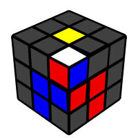
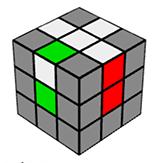
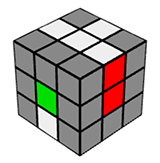
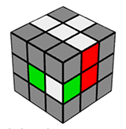

# Cubo de Rubik

## Historia
El cubo de Rubik fue creado por un profesor de arquitectura llamado Erno Rubik. El húngaro estaba obsesionado con las figuras geométricas, y por ello en 1974 decidió elaborar un cubo con un centro redondo de manera que sus piezas no se rompieran. El invento fue un todo un éxito. 

La compañía Ideal Toy Corp hizo un trato con Rubik para vender millones de copias del curioso juguete. En pocos meses, Erno pasó de ser un hombre pobre a un empresario millonario.

## Biografía de Erno Rubik

Erno Rubik inventor del famoso cubo-rompecabezas conocido en todo el mundo, y que lleva su nombre, nació en Budapest (Hungría) el 13 de julio de 1944.

Artista ecléctico, su profesión es la de escultor, arquitecto y diseñador en la Kommerziellen Kunstschule (escuela de arte comercial) de Budapest. Además del cubo del mismo nombre, Rubik es inventor de varios otros juegos de lógica y estrategia.

## Notación

Centros, Caras y Aristas


Notación Básica:


Cada letra hace referencia a una capa y están en inglés.

    U (Up): Capa Superior (Cara blanca)
    D (Down): Capa Inferior (Cara amarilla)
    R (Right): Capa Derecha (Cara Roja)
    L (Left): Capa Izquierda (Cara naranja)
    F (Front): Capa Frontal (Cara verde)
    B (Back): Capa Trasera (Cara Azul)


Tipos de giros

* Sentido horario (en sentido de las agujas del reloj)
* Antihorario (contrario a las agujas del reloj)
* Doble giro (éste no importaría si se hace horario o antihorario puesto que llegamos al mismo punto)
* Giro de dos capas (ésto quiere decir que giramos la capa U y la adyacente)


## METODO PRINCIPIANTE

1. Armar la Cruz Blanca
2. F2L, esquinas y aristas
3. Cruz Opuesta
4. Mover medios a su posicion
    Ubicar una arista que coincida con el  medio, si coinciden 2 medios mover U y hacer de que no coincida ninguno o que coincida solo un medio y empezar por ahi
```
R U R' U R U2 R'
```
5. Mover esquina a su posicion
    Emmpezar con una esquna en su posicion, si ninguno coincide empezar de cualquier lado
```
U R U' L' U R' U' L
```
6. Rotar esquinas
    Ubicar una esquina en su posicion y ponerlo al lado dercho y girar U', realizar el siguiente movimiento sin perder de vista el frente hasta que la esquina este en su posición 
```
R' D' R D
```

## Algoritmos para Speedcuber

#### Sledgehammer

```
R' F R F'
```

```
F R' F' R
```
#### Sexy Move
```
R U R' U'
```


```
(R U R' U') 3
```

#### Anti Sexy Move
```
R' U' R U
```

#### Sune
```
R U R' U R U2 R'
```

#### Anti Sune
```
R U2 R' U' R U' R'
```

#### Sune Inversa
```
L' U2 L U L' U L
```
## METODO FRIDRICH REDUCIDO
### CRUZ BLANCA

```
F U' R U
```

```
F' R' D' R F2'
```

```
R' D' R F2'
```
### F2L (First Two Layers) Primeras Dos Capas

### CRUZ AMARILLA

### OLL (Orientation of the Last Layer) Orientación de la Ultima Capa

Siete Casos

1. Caso automovil


 ```
 F ( R U R' U' )3 F'
 ```

2. Caso auto-camaleon


```
R U2 ( R2 U' )2 R2 U2 R
```

3. Caso Taxi


Dos amarillos viendo a la Izquierda
```
L' U2 L U L' U L  
R U2 R' U' R U' R'
```
Dos amarillos viendo de frente
```
Sune, Girar cubo a la Izquierda, Anti-Sune
```
Optimo, (dos amarillos viendo de frente)
```
R2 D R' U2 R D' R' U2 R'
```
4. Caso camaleon


```
R U R' U R U2 R'  (Sune)
L' U' L U' L' U2 L  (Sune Inversa
```
```
r U R' U' r' F R F'
```

5. Caso Ocho


```
R U R' U R U2 R'
Girar cubo a la derecha
L' U' L U' L' U2 L'
```
```
F R' F' r U R U' r'
```

6. Caso Pez viendo arriba


```
R U R' U R U2 R'  (Sune)
```
7. Caso Pez viendo abajo


```
L' U' L U' L' U2 L
```

### PLL (Permutation of the Last Layer) Permutación de la Ultima Capa

Permutacion tipo T


```
R U R' U' R' F R2 U' R' U' R U R' F' 

R U R' U' R' F R2 U' R' U' R U R F'

R U R' U' R' F R2 U' R U' R U R' F'
```
```
R U R' U' R' F R2 U' R' U' R U R' F' 
```

```
R U' R U X U F' U F U2 R U R' U' R
```
Aplicar cuando:

* Hay dos vertices del mismo color al lado derecho, empezar por la derecha R

* Hay dos vertices en su lugar en forma diagonal, empezar poniendo de frente un vertice en su lugar

1. Caso Horario (Ub)


```
M' U2 M U' M' U2 M U' M U2 M 
```

2. Caso Anti-horario (Ua)


```
M' U2 M U M' U2 M U M' U2 M
```
3. Caso Z


```
M2 U M2 U M' U2 M2 U2 M'
```

4. Caso H


```
M2 U M2 U2 M2 U M2
```

## CFOP (Cross, F2L, OLL, PLL)
