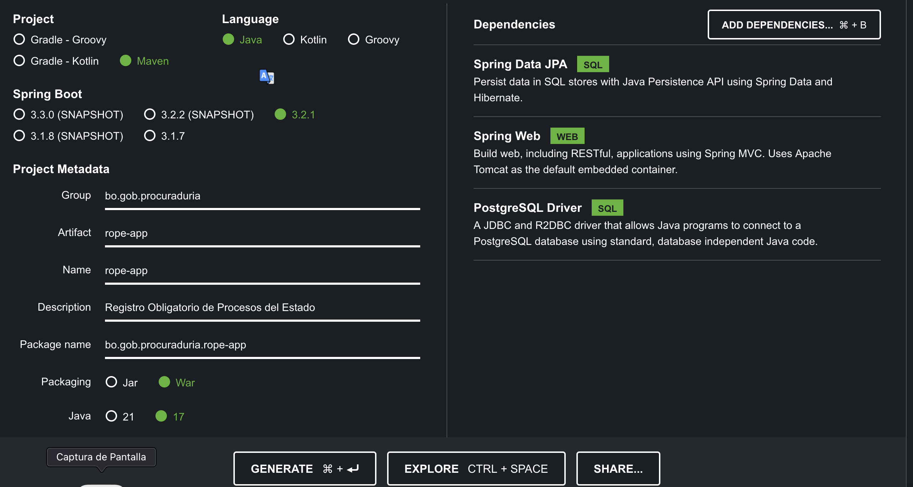
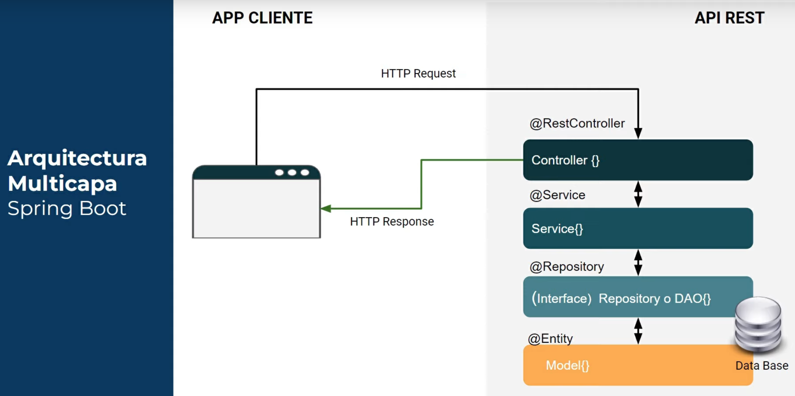

# JAVA SPRING BOOT


Spring Boot es un framework desarrollado para el trabajo con Java como lenguaje de programación. Se trata de un entorno de desarrollo de código abierto y gratuito. Spring Boot cuenta con una serie de características que han incrementado su popularidad y, en consecuencia, su uso por parte de los desarrolladores back-end. 

## IDE Desarrollo

Instalar [IntelliJ Community Edition](https://www.jetbrains.com/es-es/idea/download/?section=mac)

*Personalizar IntelliJ*

Cambiar Thema de Colores
    
    IntelliJ Menu > Preferences > Appearance & Behavior > Appearance
        Get more themes
        Material Theme UI
    
    Restart IntelliJ IDEA CE
        IntelleJ Menu > Preferences > Appearance & Behavior > Appearance
        Theme: Material Oceanic
        Apply
        Ok

Instalar Plugins
    
    IntelleJ Menu > Preferences > Plugins
        Search: Rainbow Brackets
        Install
        Restart IDE

Plugins

    Atom Material           # Thema de Colores de Material
    Raidbow Brackets        # Pone los llaves en colores
    SonarLint               # Revisa código y detecta Bugs
    Atom Material Icons     # Iconos de Material
    Spring Boot Assistant 

Key Maps

    Cmd + Alt + L           Reformatea el código
    Ctrl + Espacio          Información del código 


## Iniciar un Proyecto

Paso previo: [Instalar Java](../Java/Install_Java.md)

1. Ingresar al sitio [Spring Initializr](https://start.spring.io/)

2. Ingresar los siguientes datos:

Ejemplo:


Referencia [Iniciar Proyecto Spring Boot](https://www.arteco-consulting.com/post/tu-primera-aplicacion-con-spring-boot)

```sh
Project: Maven Project
Language: Java
Spring Boot: 3.2.1
Project Metadata:
    Group: bo.gob.pge
    Artifact: rope
    Name: rope
    Description: Registro Obligatorio de Procesos del Estado
    Package Name: bo.gob.pge.rope
Packaging: War
Java: 17
```

En dependencias inicialmente adicionar:

```sh
Spring Data JPA (SQL)
Spring Web (Web)
PostgreSQL Driver (SQL)
```

3. Presionar el boton Generar
4. Descomprimir la carpeta y abrir con el IDE

## Configurar IDE IntelliJ CE y Abrir Proyecto

1. Abrir: Open (seleccionar carpeta generada con Spring Initializr)
2. Configurar version de Java en el IDE

    File > Project Structure > Project Settings: Project
        SDK: Add JDK (Select Java Version 17), Button OPEN
        SDK: Eclipse Temurin Java17
        Button Ok
3. Configurar Maven para Ejecutar

    Run > Edit Configurations > Maven (Add Maven si no existiera) 
        Run: spring-boot:run
        Button Apply, Ok


## Establecer conexión con la Base de Datos Postgres

Paso Previo [Instalar Postgresql](../Postgres/Postgres.md)

*Parámetros de conexión a una Base de Datos Postgres*

```sh
spring.datasource.url=jdbc:postgresql://localhost:5432/your_database
spring.datasource.username=your_user
spring.datasource.password=your_password
```
*Delegar a Spring Boot la creacion de tablas*

```sh
spring.jpa.hibernate.ddl-auto=create
```
Parámetros de esta propiedad
```sh
create: se borrarán las tablas y se volveran a crear
none: no se realizará ninguna acción.
drop: se crearán las tablas a partir de las entidades y al final se borrarán.
update: realiza una actualización del esquema a partir de las entidades.
validate: sólo realiza una validación entre las entidades y el esquema de la base de datos.
```

Abrir el archivo de propiedades y editar:

Ruta: proyecto/src/main/resources/
Archivo: application.properties

```java
server.port=9090
spring.jpa.database=POSTGRESQL
spring.datasource.platform=postgres
spring.datasource.url=jdbc:postgresql://localhost:5432/ropedb
spring.datasource.username=postgres
spring.datasource.password=postgres
spring.jpa.show-sql=true
spring.jpa.generate-ddl=true
spring.jpa.hibernate.ddl-auto=update
spring.jpa.properties.hibernate.jdbc.lob.non_contextual_creation=true
``` 
Ejecutar aplicacion: Run

## Crear una página de Presentación de Backend

*Adicionar la dependencias Thymeleaf*

Editar el archivo de dependencias y plugins

Ruta: /
Archivo: pom.xml
```sh
<dependency>
	<groupId>org.springframework.boot</groupId>
	<artifactId>spring-boot-starter-thymeleaf</artifactId>
</dependency>
```

Nota: también se pueden buscar las dependencias en [Maven Repository](https://mvnrepository.com/) con el nombre "Spring Boot Thymeleaf"

*Crear un archivo Html de Presentación*

Crear un archivo
Ruta: src/main/resources/templates
Archivo: intro.html
```html
<head>
    <meta charset="UTF-8">
    <title>Backend-ROPE</title>
    <link rel="stylesheet" href="https://fonts.googleapis.com/icon?family=Material+Icons">
    <link rel="stylesheet" href="https://code.getmdl.io/1.3.0/material.indigo-pink.min.css">
    <script defer src="https://code.getmdl.io/1.3.0/material.min.js"></script>
    <style>
        <!-- Square card Style-->
        .demo-card-square.mdl-card {
        }
        .demo-card-square > .mdl-card__title {
          color: #fff;
          background: bottom right 15% no-repeat #46B6AC;
        }
        .cont {
          width: 100vw;
          height: 100vh;
          position: relative;
        }
        .sub {
          position: absolute;
          top: 50%;
          left: 50%;
          transform: translate(-50%, -50%);
        }
    </style>
</head>
<body>
<!-- Square card -->
<div class="cont">
    <div class="sub">
        <div class="demo-card-square mdl-card mdl-shadow--2dp">
            <div class="mdl-card__title mdl-card--expand">
                <h1 class="mdl-card__title-text">BACKEND TECHNOLOGY</h1>
            </div>
            <div class="mdl-card__supporting-text">
                <b>RUNNING BACKEND</b></br></br>
                Procuraduria General del Estado</br></br>
                Sistema de Registro de Procesos del Estado</br>
                ROPE version 2.0
            </div>
            <div class="mdl-card__actions mdl-card--border">
               <p style="text-align:center">© Copyright PGE - 2024</p>
            </div>
        </div>
    </div>
</div>
</body>
</html>
```

*Crear el Controlador*

Crear un nuevo paquete
Ruta: src/main/java/bo.gob.pge.rope
Paquete: intro

Crear un Controlador
Ruta: src/main/java/bo.gob.pge.rope/intro
Archivo: IntroController
```java
package bo.gob.pge.rope.intro;

import org.springframework.stereotype.Controller;
import org.springframework.web.bind.annotation.RequestMapping;

@Controller
public class IntroController {
    @RequestMapping ("/")
    public String intro() {
        return "intro";
    }
}
```
Nota: Las extensiones de los archivos creados son .java

## Arquitectura Multicapa de Spring Boot



## Crear un API REST CRUD para una tabla

Adicionar la dependencia Lombok
Ruta: /
Archivo: pom.xml
```sh
<dependency>
    <groupId>org.projectlombok</groupId>
    <artifactId>lombok</artifactId>
    <optional>true</optional>
</dependency>
```
*Como ejemplo se creara una tabla paramétrica Deptos (Departamentos)*

Crear Paquete Entity
Ruta: src/main/java/bo.gob.pge.rope/
Paquete: entity

Crear archivo de Clase para el Entity
Archivo: Depto (Class)

```java
package bo.gob.pge.rope.model;
import jakarta.persistence.*;
import lombok.Data;

@Entity
@Table (name = "deptos")
@Data                    // Getters, Setters y Constructor
public class Depto {
    @Id
    @GeneratedValue(strategy = GenerationType.IDENTITY)
    private Long id;
    @Basic               // Campos basicos para el resto de atributos
    private String descrip;
    private String cod;
}
```

Crear Paquete Repository
Ruta: src/main/java/bo.gob.pge.rope/
Paquete: repository

Crear archivo de Interface 
Archivo: DeptoRepository (Class Interface)

```java
package bo.gob.pge.rope.repository;

import bo.gob.pge.rope.entity.Depto;
import org.springframework.data.jpa.repository.JpaRepository;

public interface DeptoRepository extends JpaRepository<Depto, Long> {
}
```

Crear Paquete Service
Ruta: src/main/java/bo.gob.pge.rope/
Paquete: service

Crear archivo de Clase
Archivo: DeptoService (Class)

```java
package bo.gob.pge.rope.service;

import bo.gob.pge.rope.model.Depto;
import bo.gob.pge.rope.repository.DeptoRepository;
import org.springframework.beans.factory.annotation.Autowired;
import org.springframework.stereotype.Service;

import java.util.List;
import java.util.Optional;

@Service
public class DeptoService {
    private final DeptoRepository deptoRepository;

    @Autowired
    public DeptoService(DeptoRepository deptoRepository) {
        this.deptoRepository = deptoRepository;
    }

    public List<Depto> getDeptos() {
        return deptoRepository.findAll();
    }

    public Optional<Depto> getDeptoById(Long id) {
        return deptoRepository.findById(id);
    }

    public Depto createDepto(Depto depto) {
        return deptoRepository.save(depto);
    }

    public void deleteDepto(Long id) {
        deptoRepository.deleteById(id);
    }
}
```

Crear Paquete Controller
Ruta: src/main/java/bo.gob.pge.rope/
Paquete: controller

Crear archivo de Clase 
Archivo: DeptoController (Class)

```java
package bo.gob.pge.rope.controller;

import bo.gob.pge.rope.model.Depto;
import bo.gob.pge.rope.service.DeptoService;
import org.springframework.beans.factory.annotation.Autowired;
import org.springframework.web.bind.annotation.*;

import java.util.List;

@RestController
@RequestMapping("/api/depto")
public class DeptoController {
    private final DeptoService deptoService;

    @Autowired
    public DeptoController(DeptoService deptoService) {
        this.deptoService = deptoService;
    }

    @GetMapping
    public List<Depto> getDeptos() {
        return deptoService.getDeptos();
    }

    @GetMapping("/{id}")
    public Depto getDeptoById(@PathVariable Long id) {
        return deptoService.getDeptoById(id).orElse(null);
    }

    @PostMapping
    public Depto createDepto(@RequestBody Depto depto) {
        return deptoService.createDepto(depto);
    }

    @PutMapping
    public Depto updateDepto(@RequestBody Depto updatedDepto) {
        return deptoService.createDepto(updatedDepto);
    }

    @DeleteMapping("/{id}")
    public void deleteDepto(@PathVariable Long id) {
        deptoService.deleteDepto(id);
    }

}
```
## Comprobar las APIS

Instalar Postman 

    Descargar el Intalador de [Postman](https://www.postman.com/downloads/)
    Instalar
    Crear una cuenta o ingresar con cuenta de correo Gmail  

Abrir Postman

Listado General

    GET: localhost:9090/api/depto

Listado por id

    GET: localhost:9090/api/depto/1

Crear un registro

    POST: localhost:9090/api/depto

        Boby > raw : JSON

        {
            "descrip" : "LA PAZ",
            "cod" : "LPZ"
        }

Modificar un registro

    PUT: localhost:9090/api/depto

        Boby > raw : JSON

        {
            "id" : 1, 
            "descrip" : "LA PAZ",
            "cod" : "LP"
        }

Eliminar registro

    DELETE: localhost:9090/api/depto/1

