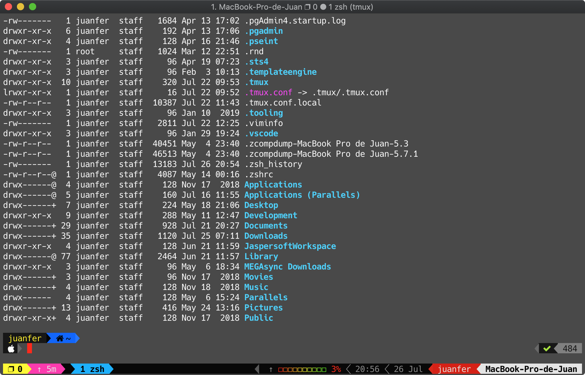
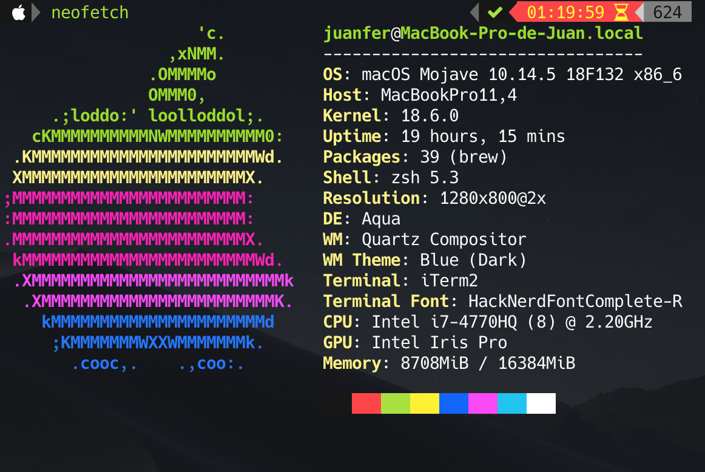

# tmux

## Install tmux in MacOS

```sh
brew install tmux
```

## Instalar tmux en linux Debian

```sh
sudo apt-get install tmux
```

## Oh My Tmux! Pretty & versatile tmux configuration 

[source:Oh My Tmux](https://github.com/gpakosz/.tmux) 

Requerimets:

* tmux >= 2.1

```sh
tmux -V
```

* outside for tmux $TERM must be set to: xterm-256color

edit ~/.zshrc

```sh
export TERM="xterm-256color"
```

Install:

* change directory

```sh
cd ~/
```

* backup if exist ~/.tmux.conf

```sh
cp ~/.tmux.conf ~/.tmux.conf.backup
```

* run the following

```sh
git clone https://github.com/gpakosz/.tmux.git
ln -s -f .tmux/.tmux.conf
cp .tmux/.tmux.conf.local .
``` 

## Enabling the Powerline look

* Install PowerlineSymbol
* Then edit the ~/.tmux.conf.local file (<prefix> e) and adjust the following variables:

```sh
tmux_conf_theme_left_separator_main='\uE0B0'
tmux_conf_theme_left_separator_sub='\uE0B1'
tmux_conf_theme_right_separator_main='\uE0B2'
tmux_conf_theme_right_separator_sub='\uE0B3'
```

* Custom Color, edit the ~/.tmux.conf.local

```sh
# status left style
tmux_conf_theme_status_left_fg='#000000,#000000,#e4e4e4'  # black, white , white
tmux_conf_theme_status_left_bg='#ffff00,#00FF00,#00afff'  # yellow, pink, white blue
tmux_conf_theme_status_left_attr='bold,none,none'
```

* Left-Right Status Bar

```sh
tmux_conf_theme_status_left=' ❐ #S | ↑#{?uptime_y, #{uptime_y}y,}#{?uptime_d, #{uptime_d}d,}#{?uptime_h, #{uptime_h}h,}#{?uptime_m, #{uptime_m}m,} '
tmux_conf_theme_status_right='#{prefix}#{pairing}#{synchronized} #{?battery_status, #{battery_status},}#{?battery_bar, #{battery_bar},}#{?battery_percentage, #{battery$
```
* Restart System
* Run tmux

## Accessing the macOS clipboard from within tmux sessions

``` sh
brew install reattach-to-user-namespace
```

## Habilitar el mouse en los paneles de tmux

Editar el archivo tmux.con
```sh
nvim ~/.tmux.conf
```
```sh
setw -g mouse on
```
Habilitar Clipboard (copiar y pegar) 
```
Abrir iTerm2
Menu: iTerm2, Preferences, Selection
Check On: Aplications in terminal may access clipboard
```

# Tmux concepts
[Tutorial Tmux](https://www.youtube.com/watch?v=vwRxelWEuFE)

Permite utilizar varias consolas virtuales desde una misma terminal.

Ventajas.

- Restaurar Sesiones
- Organizar Terminales
- Cambiar de Entorno

Conceptos.

*Session*. Consolas virtuales gestionadas por tmux, se pueden dividir en Ventanas.

*Ventana*. Ocupan el espacio total de pantalla y se puede divir en paneles.

*Panel*. Regiones en una ventana, se pueden ejecutar una consola virtual independiente.

Arquitectura.

Cliente/Servidor, al ejecutar tmux se crean dos procesos uno para servidor y otro para cliente, estos procesos se comunican entre si mediante el envio de comandos. El Cliente envia comandos al servidor de tmux para que los ejecute, el Servidor ejecuta los comandos y gestiona sesiones y consolas virtuales, el servidor seguirá ejecutando las sesiones en segundo plano.

# Comandos Tmux

Prefijo: Ctrl+b

## Comandos de Sesiones

* Crear una nueva sessión

```sh
tmux
```
Luego cerrar ventana

* Listar sesiones

``` sh
tmux list-sessions
```

``` sh
tmux ls
```

* Conectarnos a la última sesión

```sh
tmux attach
```

* Conectarnos a una sesión específica

```sh
tmux attach-session -t 7
```

* Crear nueva sessión desde una session abierta con tmux: *Ctrl+b : new -s name-session*
* Desconectarnos de una sesión: *Ctrl+b d*
* Renombrar una sesión: *Ctrl+b $*
* Navegar entre sesiones: *Ctrl+b s*
* Matar una sesion: *Ctrl+b :  kill-session* or

```sh
exit
```
or

```sh
tmux kill-session -t name_session
```

## Comandos de Ventanas
1. Crear nueva ventana: *Ctrl+b c*
2. Renombrar ventena: *Ctrl+b ,*
3. Navegar entre ventanas: *Ctrl+b 1, Ctrl+b 2, etc.*

## Comandos de Paneles
* Dividir horizontalmente: *Ctrl+b "*
* Dividir verticalmente: *Ctrl+b %*
* Navergar entre paneles: *Ctrl+b cursor*
* Mostrar lista de paneles: *Ctrl+w* y *flecha derecha para expandir lista, felcha arriba y abajo para navegar dentro de la lista*
* Cerrar panel activo: *Ctrl+b x [y/n]*  or type command *$exit*
* Layouts predefinidos: *Ctrl+b spacebar*
* Redimensional panel de forma exacta: *Ctrl+b : resize-pane -L 15  (or -D, -L, -R)* 
* Redimensionar panel de forma dinámica: *Ctrl+b+flechas* 
* Activar Scrooll en el panel: *Ctrl+b [ y presionar Q para desactivar*
* Zoom de panel o ampliar Panel en toda la ventana: *Ctrl+b z*, presionar *Ctrl+b z* para volver a su estado anterior
* Mostrar número de panel: *Ctrl+b q*
* Mover panel a la izquierda: *Ctrl+b {*
* Mover panel a la derecha: *Ctrl+b }*
* Cerrar panel: *Ctrl+b x*
* Activar el Mouse para cambiar entre paneles y mover *Ctrl+b : setw -g mouse on*


# Tmux Miscelania
[Tutorial Tmux MacOs](https://www.youtube.com/watch?v=srakeCXCITw)

## Install Calcurse

```sh
brew install calcurse
calcurse
```

## Install htop

```sh
brew install htop
htop
```

## Install tty-clock

```sh
brew install tty-clock
tty-clock
```
```sh
tty-clock -s
```
## Neofetch



[Fuente](https://tecnonucleous.com/2018/12/25/como-instalar-neofetch-en-windows-10-y-en-linux/)

Neofetch es un programa escrito en lenguaje bash que nos permite ver en la terminal la información básica de nuestro hardware, así como del software. La información se muestra mediante el uso de colores y divertidos logotipos del sistema operativo ascii junto con información sobre tu sistema.

Instalar Neofetch en MacOs

```sh
brew install neofetch
```

```sh
neofetch
```

```sh
neofetch --help
```

Instalar en Windows 10
```sh
powershell Set-ExecutionPolicy RemoteSigned -scope CurrentUser
iex (new-object net.webclient).downloadstring('https://get.scoop.sh')
scoop install git
scoop install neofetch
```
```sh
neofetch
```

Instalar en Linux Debian

```sh
sudo apt-get update
sudo apt-get install neofetch
neofetch
```

## Instalar Cowsay

```sh
brew install cowsay
```
Muestra un mensaje en pantalla con la figura de una vaca
```sh
cowsay "Hello World"
```

## Instalar Gotop

```sh
brew install gotop
````
```sh
gotop
```
Q para salir

## Instalar CMatrix

```sh
brew install cmatrix
```
Mostrar efecto Matriz
```sh
cmatrix
```
Q para salir


