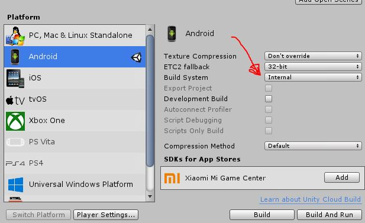

# Unity 2018
## Create Application AR for Android

https://www.youtube.com/watch?v=vNU5r11rImg

https://www.youtube.com/watch?v=MtiUx_szKbI

### Install Unity, Vuforia AR Support, Android Support

[Download Unity Personal Edition](https://store.unity.com/es/download?ref=personal)


### Activate License

    Create accouny in Unity
    Activate license Manually, Generate File
    Login to the account, Generate Personal License, Load File Licence

### Create Project Unity

* Open Unity, Projects, New
	Project Name: ARGigantesLPZApp
	Location: UnityProjects
	Template: 3D
  Create project
* Delete Main Camera from Hierachy Panel
* Menu GamePbject, Vuforia Engine, AR Camera, Import
* Activate Recent Import
	File, Buil Settings, Select Android, Player Settings, XR Settings, Check Vuforia Augmented Realit

* Activate license of the vuforia library
	Open URL: https://developer.vuforia.com/
	Login, Develop Tab, License Manager, Get Development Key
	License Name: ARGigantesLPZApp
	Check box terms, Confirm
	Select App Name, copy License key

	Select AR Camera from Hierarchy Panel, Inspector Tab, Vuforia Behaviou (Script), button Open Vuforia Engine configuration, Global, App License Key: Paste License
* Config AR Camera
    Set values Transform:
	Position: 0,  150, -100
	Rotation: 50, 0, 0
	Scale:    1, 1, 1
* Add Image Marker
	
	GameObject Menu, Vuforia Engine, Image, Import

	Open https://developer.vuforia.com/
	Login, Develop Tab, Target Manager, Add Database
		Create Database Name: GigantesLpzDB, Type: Device, Create
		Select Database, Add Target
		File Browse select Image
			Width: 500
			Name: Id_Image_Name
			Add Button
		Select Images checking box, Download Database, Unity Editor, Download
		Doble click File Donloaded, Import

* Set Image Marker
	Image Target, Image target Behaviour, Database: Select Database, Image Target: Select Image
	Transform, Scale X: 100 Y: 100 Z: 100
	
* Import Model Sketchup to Unity
    Open Sketchup, Open Model, Select Model Area
    Menu Archivo, Exportar, Modelo 3D, Create Folder to Model 3D
        Nombre: Name_Model
        Tipo: 3DS
        Opciones: Exportar Jerarquia Completa
                  Exportar solo la selección actual
                  Exportar mapas de textura, Unión de los vértices
                  Escala: Unidades del Modelo  
    Copy Folder Model to ..\Project_Unity\Assets
    Open or Focus Unity to import model automatically

* Drag and drop model 3D to Hierarchy Panel, Drag and Drop to ImageTarget, Play

* Add a second marker
    GameObject, Vuforia Engine, Image
                    X:      Y:     Z:   
        Position:   80      0      0
        Scale:      100     100    100

    Image Target Behaviuor (Script)
        Database: Name_Database_Images
        Image Target: Name_Image
    
    Drag and drop the corresponding 3d model
        Position:   80      0      0
        Drag and drop model to Image Target
    Play To Test

### Compile application for android

* Config Application
    File, Build Setting, Platform: Android, 
    Player Settings  
    Company Name: lapazdigital
    Product Name: argiganteslpzapp

    Other Settings
    Package Name: com.lapazdigital.argigantelpzapp

    Uncheck Android TV

    Path Android SDK Tools
    C:\Users\user_name\AppData\Local\Android\Sdk

* Create Scene
    Clich right SampleScene, Save Scene As, Set Name Scene
    File, build Settings, Add Scenes
    Switch Plataform, Build

    Error: Gradle prewarm failed

    [Solutions](https://answers.unity.com/questions/1419389/how-to-fix-android-gradle-failure.html):

    [1] Changed from Gradle to Internal on build settings and it worked
    

    [2] Use jdk 8 instead of 9 or 10 and it will build successfully, just tested and it works. 

* Event Handle Manager Custom Marker
    Open file Project_Unity/Assets/Vuforia/Scripts/DefaultTrackableEventHandler.cs
    Edit File:

    ```cs
        private void OnTrackingFound()
        {
            Renderer[] rendererComponents = GetComponentsInChildren<Renderer>(true);
            Collider[] colliderComponents = GetComponentsInChildren<Collider>(true);

            // Enable rendering:
            foreach (Renderer component in rendererComponents)
            {
                component.enabled = true;
            }

            // Enable colliders:
            foreach (Collider component in colliderComponents)
            {
                component.enabled = true;
            }

            Debug.Log("Trackable " + mTrackableBehaviour.TrackableName + " found");

			if (mTrackableBehaviour.TrackableName == "san_antonio") {
				Debug.Log ("Proyecto San Antonio");
				Application.OpenURL("https://www.youtube.com/embed/xQHnZ0EENzI?autoplay=1&start=0");
			}

        }
    ```

## Create Animation

    * Select Object 3D
    * Menu Window Animation, create, create folder animation, asign name animation
    * Add Property button, Transform, Rotation, clic button (+)
    * Select Key Frame Recorder to set Keys

## Create Virtual Button vuforia

    URL: https://www.youtube.com/watch?v=ElmzIq6stNI

    * Select Image Target, Expand Advanced, Add Virtual Button, custom Position and Size, Asign Name Ex: VirtualButtonTorresPoeta, Sensitive Settings: MEDIUM
    * Click right over VirtualButton, 3D Object, Plane, Resize to virtualButton, Drag and Drop images button to Plane
    * In Vuforia\Scripts, right click, Create, C# Script, asign name Ex. clsVBTorrezPoeta
    * Edit Script:

    ```cs
using System.Collections;
using System.Collections.Generic;
using UnityEngine;
using Vuforia;   // <-- Add

public class clsVBTorresPoeta : MonoBehaviour, IVirtualButtonEventHandler  // <--- Add
{
    // Global Variables
    private GameObject virtualButtonObject;  // <-- Add

    // Start is called before the first frame update
    void Start()
    {
        virtualButtonObject = GameObject.Find("VirtualButtonTorresPoeta");
        virtualButtonObject.GetComponent<VirtualButtonBehaviour>().RegisterEventHandler(this);
    }

    // Update is called once per frame
    void Update()
    {
        
    }

    public void OnButtonPressed(VirtualButtonBehaviour vb)
    {
        Debug.Log(">> TORRES DEL POETA");
        Application.OpenURL("https://www.youtube.com/embed/z1YudJd1diU?autoplay=1&start=0");

        if (virtualButtonObject != null)
        {
            virtualButtonObject.GetComponent<VirtualButtonBehaviour>().enabled = false;
        }
        //throw new System.NotImplementedException();
    }

    public void OnButtonReleased(VirtualButtonBehaviour vb)
    {
        throw new System.NotImplementedException();
    }
}
    ```
* In to Image Target, Add Component, Script, ScriptName Ex. clsVBTorrezPoeta or
  Drag and Drop script file
* In Virtual Button, Virtual Button Behaviour (Script) verify name  Ex:   VirtualButtonTorresPoeta

## Publish application on Google Play

Obtener una cuenta Desarrollador de Google Play Console
https://www.youtube.com/watch?v=uRdwFbXcPo8

Subir aplicaciones a la Play Store
https://www.youtube.com/watch?v=HAbW0dhRWvI

* Build Application to APK, Fill Data, Publishing Settings in Unity
* Create account on Google
* Open https://play.google.com/apps/publish
* Login
* Crear Aplicacion
* Llenar Ficha de Play Store hasta Categoria, Guardar Borrador, para Clasificación de Contenido se tiene que subir el archivo.apk
* Subir el APK
    Ir a  Versiones de la Aplicación
    Segmento de Producción, GESTIONAR, CREAR VERSION,
    SEGUIR, Examinar Archivos, Seleccionar el Archivo.apk, en novedades de la version escrivir la versión, Ej. Versión 1.0, Presionar GUARDAR, REVIZAR
* En Android App Bundles y archivos APK para añadir, EXAMINAR ARCHIVOS, SUBIR

Errores:
[1] Falta el código de versión mínima de dependencia de ARCore com.google.ar.core.min_apk_version
Solucion.
    Cerrar Unity
    Abrir el archivo: Application/Unity/PlaybackEngines/AndroidPlayer/Apk/AndroidManifiest.xml
    En el tag  <application  
    adicionar <meta-data android:name="com.google.ar.core.min_apk_version" android:value="24" /> 

```xml
<?xml version="1.0" encoding="utf-8"?>
<manifest
    xmlns:android="http://schemas.android.com/apk/res/android"
    package="com.unity3d.player"
    xmlns:tools="http://schemas.android.com/tools"
    android:installLocation="preferExternal">
    <supports-screens
        android:smallScreens="true"
        android:normalScreens="true"
        android:largeScreens="true"
        android:xlargeScreens="true"
        android:anyDensity="true"/>

    <application
        android:theme="@style/UnityThemeSelector"
        android:icon="@mipmap/app_icon"
        android:label="@string/app_name">
        <meta-data android:name="com.google.ar.core.min_apk_version" android:value="24" />
        <activity android:name="com.unity3d.player.UnityPlayerActivity"
                  android:label="@string/app_name">
            <intent-filter>
                <action android:name="android.intent.action.MAIN" />
                <category android:name="android.intent.category.LAUNCHER" />
            </intent-filter>
            <meta-data android:name="unityplayer.UnityActivity" android:value="true" />
        </activity>
    </application>
</manifest>
```
    Volver a compilar, Build 

[2] Has subido un APK o Android App Bundle firmados en modo de depuración, pero debes firmarlos en modo de publicación.
Solucion.
    Crear los Keys desde Unity, File, Buil Setting, 

[3] Un archivo APK de tu aplicación tiene el código de versión 1 que solicita los siguientes permisos: android.permission.CAMERA.

Solución:
    Crear Politicas de Privacidad y publicarlo en el hosting institucional


## APK KEY LA PAZ RA
NameApp: lapazra
Password: lapazdigital
