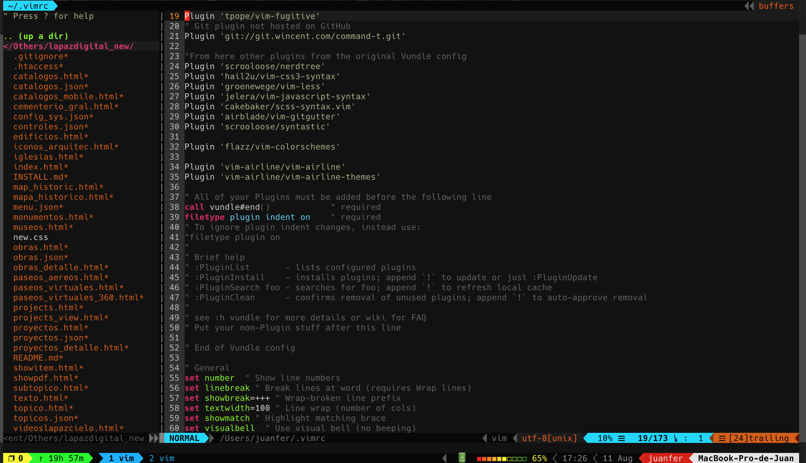
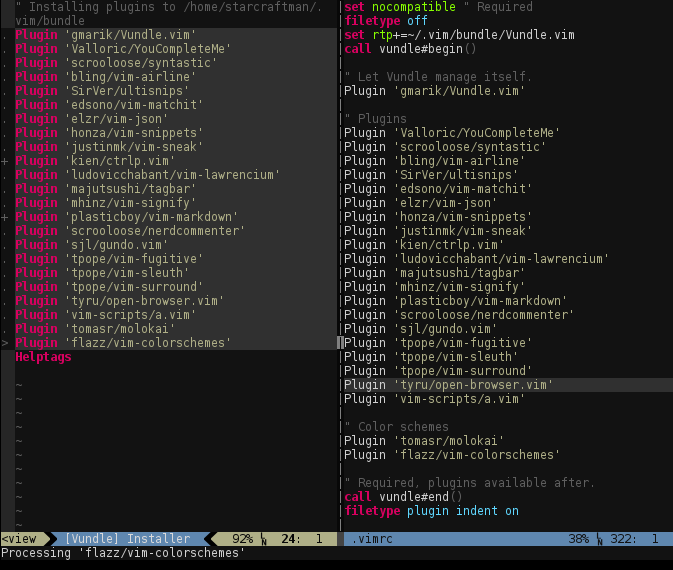
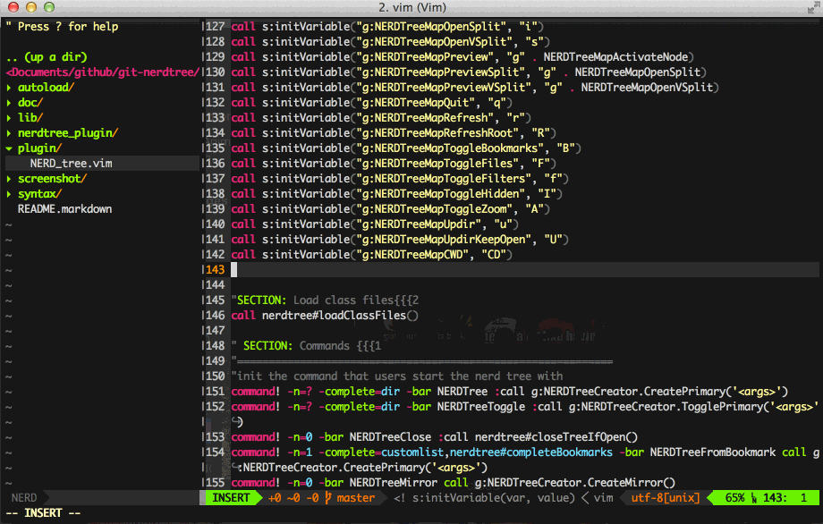

# Vim


Vim, (Vi Improved), versión mejorada del editor de texto Vi, creado en 1976 por Bill Joy que tomó recursos de ed y ex, dos editores de texto para Unix. 

Vim, fue presentado en el año 1991 y desde entonces no ha dejado de experimentar infinidad de mejoras.

La característica más destacable de este editor es su modo de edición modal, en los que seremos capaces de realizar distintos tipos de operaciones.

## **_Diferentes modos de Vim_**



**Modo Normal**. Éste es el modo central, desde el que se cambia a los otros modos, Se activa pulsando la tecla ESC. 

**Modo insertar**. Es el modo en el que podemos introducir texto. Se puede entrar a este modo desde el modo normal pulsando la tecla i. 

**Modo de comandos**. Se accede pulsando :  Permite introducir diferentes comandos, como buscar y reemplazar con expresiones regulares. También podremos personalizar aspectos de Vim.

**Modo visual**. Se entra pulsando la tecla v. Es como seleccionar texto con el cursor, solo que podremos escribir comandos para manipularlo.

**Modo selección**. Se entra desde el modo visual pulsando Ctrl-G. Tiene un comportamiento similar al modo visual solo que al escribir no realizaremos comandos sino que reemplazaremos el texto, como en un editor de texto normal,

**Modo Ex**. Este modo se asemeja al modo de comandos, con la diferencia de que tras la ejecución de una orden no se vuelve al modo normal. Se entra pulsando Q y se sale con vi.

## Instalación

Install in MacOs

```
vim --version
brew update
brew install vim
vim
```

Install in Linux Debian

```
sudo apt-get remove vim-tiny
sudo apt-get update
sudo apt-get install vim
```

Install in Windows

[Download Vim for windows](https://www.vim.org/download.php#pc)

# COMANDOS VIM

* [Comandos Vim](Vim_Commands.md "Comandos Vim")


# PERSONALIZAR VIM (CUSTOM VIM)
## Plugin Manager Vundle for Vim



**Install Vundle**

```
cd ~/
mkdir ~/.vim/bundle
git clone https://github.com/gmarik/Vundle.vim.git ~/.vim/bundle/Vundle.vim
touch ~/.vimrc
```

**Edit file ~/.vimrc**

```sh
" Vundle config

set nocompatible              " be iMproved, required
filetype off                  " required

" set the runtime path to include Vundle and initialize
set rtp+=~/.vim/bundle/Vundle.vim
call vundle#begin()
" alternatively, pass a path where Vundle should install plugins
"call vundle#begin('~/some/path/here')

" let Vundle manage Vundle, required
" Plugin 'gmarik/Vundle.vim'
Plugin 'VundleVim/Vundle.vim'

" The following are examples of different formats supported.
" Keep Plugin commands between vundle#begin/end.
" plugin on GitHub repo
Plugin 'tpope/vim-fugitive'
" Git plugin not hosted on GitHub
Plugin 'git://git.wincent.com/command-t.git'

"From here other plugins from the original Vundle config
Plugin 'scrooloose/nerdtree'        
Plugin 'hail2u/vim-css3-syntax'
Plugin 'groenewege/vim-less'
Plugin 'jelera/vim-javascript-syntax'
Plugin 'cakebaker/scss-syntax.vim'
Plugin 'airblade/vim-gitgutter'
Plugin 'scrooloose/syntastic'

Plugin 'flazz/vim-colorschemes'

Plugin 'vim-airline/vim-airline'
Plugin 'vim-airline/vim-airline-themes'

" All of your Plugins must be added before the following line
call vundle#end()            " required
filetype plugin indent on    " required
" To ignore plugin indent changes, instead use:
"filetype plugin on
"
" Brief help
" :PluginList       - lists configured plugins
" :PluginInstall    - installs plugins; append `!` to update or just :PluginUpdate
" :PluginSearch foo - searches for foo; append `!` to refresh local cache
" :PluginClean      - confirms removal of unused plugins; append `!` to auto-approve removal
"
" see :h vundle for more details or wiki for FAQ
" Put your non-Plugin stuff after this line

" End of Vundle config

" General
set number  " Show line numbers
set linebreak " Break lines at word (requires Wrap lines)
set showbreak=+++ " Wrap-broken line prefix
set textwidth=100 " Line wrap (number of cols)
set showmatch " Highlight matching brace
set visualbell  " Use visual bell (no beeping)
 
set hlsearch  " Highlight all search results
set smartcase " Enable smart-case search
set ignorecase  " Always case-insensitive
set incsearch " Searches for strings incrementally
 
set autoindent  " Auto-indent new lines
set expandtab " Use spaces instead of tabs
set shiftwidth=2  " Number of auto-indent spaces
set smartindent " Enable smart-indent
set smarttab  " Enable smart-tabs
set softtabstop=2 " Number of spaces per Tab
 
set cursorline

" Advanced
set ruler " Show row and column ruler information
 
set undolevels=1000 " Number of undo levels
set backspace=indent,eol,start  " Backspace behaviour
 
 
" Generated by VimConfig.com

set mouse=a " activate mouse

" Autoload NERDTree if no file specified

autocmd StdinReadPre * let s:std_in=1
autocmd VimEnter * if argc() == 0 && !exists("s:std_in") | NERDTree | endif

" Auto close NERDTree if no more files

autocmd bufenter * if (winnr("$") == 1 && exists("b:NERDTreeType") && b:NERDTreeType == "primary") | q | endif

" Show hidden files in NERDTree

let NERDTreeShowHidden=1

"syntax off

syntax on

" enable copy to clipboard

set clipboard=unnamed

" copy to clipboard with Ctrl-C

map <C-x> :!pbcopy<CR>
vmap <C-c> :w !pbcopy<CR><CR>

" paste from clipboard with Ctrl-V

set pastetoggle=<F10>
inoremap <C-v> <F10><C-r>+<F10>

"""""""""""""""""""""""""""
" Git-gutter configuration
"""""""""""""""""""""""""""

let g:gitgutter_updatetime = 750
let g:syntastic_auto_loc_list = 1
let g:syntastic_check_on_open = 1

set statusline+=%#warningmsg#
set statusline+=%{SyntasticStatuslineFlag()}
set statusline+=%*

"""""""""""""""""""""""""""
" Syntastic configuration
"""""""""""""""""""""""""""
let g:syntastic_always_populate_loc_list = 1
let g:syntastic_auto_loc_list = 1
let g:syntastic_check_on_open = 0
let g:syntastic_check_on_wq = 0


" so that syntastic uses .jshintrc files if present - http://stackoverflow.com/questions/28573553/how-can-i-make-syntastic-load-a-different-checker-based-on-existance-of-files-in

autocmd FileType javascript let b:syntastic_checkers = findfile('.jshintrc', '.;') != '' ? ['jshint'] : ['standard']

"""""""""""""""""""""""""""
" Powerline Fonts
"""""""""""""""""""""""""""
" air-line

let g:airline_powerline_fonts = 1

"""""""""""""""""""""""""""
" Custom Airline
"""""""""""""""""""""""""""
let g:airline_theme='simple'
let g:airline#extensions#tabline#enabled = 1

"""""""""""""""""""""""""""
" Custom (no plugin related)
"""""""""""""""""""""""""""

" show filename
set statusline+=%F

""""""""""""""""""""""""""
" Color Schema
""""""""""""""""""""""""""
colorscheme molokai

```

## Install Plugins in vim

```
vim

:PluginInstall
```

Or

```
vim +PluginInstall +qall
```

Plugins command
```
:PluginList       - lists configured plugins
:PluginInstall    - installs plugins; append `!` to update or just :PluginUpdate
:PluginSearch foo - searches for foo; append `!` to refresh local cache
:PluginClean      - confirms removal of unused plugins; append `!` to auto-approve removal

```

## Plugins for Vim

vim ~/.vimrc

```sh

call vundle#begin()

Plugin 'plugin-name'

call vundle#end()

```
```
vim

:PluginInstall
```
### Vim ColorSchemes

vim ~/.vimrc

```
Plugin 'flazz/vim-colorschemes'

:PluginInstall
```
```
""""""""""""""""""""""""""
" Color Schema
""""""""""""""""""""""""""
colorscheme molokai

" colorscheme SerialExperimentsLain
```

### Airline

[Source Airline](https://github.com/vim-airline/vim-airline)

```
Plugin 'vim-airline/vim-airline'
Plugin 'vim-airline/vim-airline-themes'
```

Configuration Airline

Set AirlineTheme

vim ~/.vimrc

```
let g:airline_theme='simple'
```

Themes Airline:
* simple
* dark
* light
* base16
* jellybeans
* tomorrow
* violet
* solarized
* papercolor

**Integrating with powerline fonts**

vim ~/.vimrc

```
let g:airline_powerline_fonts = 1
```

**Smarter tab line**

vim ~/.vimrc

```sh
let g:airline#extensions#tabline#enabled = 1
```

Switching between tabs in vim with vim-airline

```
:bn
:bp
:b5
```

### NERDTree



**Install NERDTree**

vim ~/.vimrc

```
Plugin 'scrooloose/nerdtree'

:PluginInstall

or

:BundleInstall
```

Commands NERDTree

```
:NERDTree               Open tree view
:NERDTreeClose          Close tree view
:NERDTreeToggle         Toggle tree view
:NERDTreeFind           Find tree current file directory

Ctrl+ww                 Swap between panels
i                       Open file in horizontal panel
s                       Open file in vertical panel
t                       Open file in new Tab and edit
T                       Open file in new Tab
m                       Show menu NERDTree
                        a       Add File current Node

" Airline

:tabne                  Navigate betwen Tabs

:q                      Close panel   
```

### Vim DevIcons

Install Nerd Fonts

```
brew tap homebrew/cask-fonts
brew cask install font-hack-nerd-font
```

Install Plugin 'ryanoasis/vim-devicons'

vim ~/.vimrc
```
Pluging 'ryanoasis/vim-devicons'

:PluginInstall
```

## Error and Warnings of run Vim

### Warning Failed to set locale category

```
vim

Warning: Failed to set locale category LC_NUMERIC to es_BO.
Warning: Failed to set locale category LC_TIME to es_BO.
Warning: Failed to set locale category LC_COLLATE to es_BO.
Warning: Failed to set locale category LC_MONETARY to es_BO.
Warning: Failed to set locale category LC_MESSAGES to es_BO.
```
Fix.

```
defaults read -g AppleLocale
defaults read -g AppleLanguages

vim ~/.bash_profile
vim ~/.zshrc
```

Edit files and add line

```sh
export LC_ALL=en_US.UTF-8
```
Restart System

### Why vim was opening markdown or html files slowly

Fix. Uninstall Plugin 'skammer/vim-css-color'

vim ~/.vimrc
```
" delete

Plugin 'skammer/vim-css-color'

:PluginClean 

```

# Vim Is The Perfect IDE Developer

[Source Article](https://coderoncode.com/tools/2017/04/16/vim-the-perfect-ide.html)

[GitHub](https://github.com/amacgregor/dot-files)

vim ~/.vimrc 

```vim
""""""""""""""""""""""""""""""""""""""""""""""
" Vim Is The Perfect IDE - Vimrc configuration 
""""""""""""""""""""""""""""""""""""""""""""""
set nocompatible
syntax on
set nowrap
set encoding=utf8

"""" START Vundle Configuration 

" Disable file type for vundle
filetype off                  " required

" set the runtime path to include Vundle and initialize
set rtp+=~/.vim/bundle/Vundle.vim
call vundle#begin()

" let Vundle manage Vundle, required
Plugin 'gmarik/Vundle.vim'

" Utility
Plugin 'scrooloose/nerdtree'
Plugin 'majutsushi/tagbar'
Plugin 'ervandew/supertab'
Plugin 'BufOnly.vim'
Plugin 'wesQ3/vim-windowswap'
Plugin 'SirVer/ultisnips'
Plugin 'junegunn/fzf.vim'
Plugin 'junegunn/fzf'
Plugin 'godlygeek/tabular'
Plugin 'ctrlpvim/ctrlp.vim'
Plugin 'benmills/vimux'
Plugin 'jeetsukumaran/vim-buffergator'
Plugin 'gilsondev/searchtasks.vim'
Plugin 'Shougo/neocomplete.vim'
Plugin 'tpope/vim-dispatch'

" Generic Programming Support 
Plugin 'jakedouglas/exuberant-ctags'
Plugin 'honza/vim-snippets'
Plugin 'Townk/vim-autoclose'
Plugin 'tomtom/tcomment_vim'
Plugin 'tobyS/vmustache'
Plugin 'janko-m/vim-test'
Plugin 'maksimr/vim-jsbeautify'
Plugin 'vim-syntastic/syntastic'
Plugin 'neomake/neomake'

" Markdown / Writting
Plugin 'reedes/vim-pencil'
Plugin 'tpope/vim-markdown'
Plugin 'jtratner/vim-flavored-markdown'
Plugin 'LanguageTool'

" Git Support
Plugin 'kablamo/vim-git-log'
Plugin 'gregsexton/gitv'
Plugin 'tpope/vim-fugitive'
"Plugin 'jaxbot/github-issues.vim'

" PHP Support
Plugin 'phpvim/phpcd.vim'
Plugin 'tobyS/pdv'

" Erlang Support
Plugin 'vim-erlang/vim-erlang-tags'
Plugin 'vim-erlang/vim-erlang-runtime'
Plugin 'vim-erlang/vim-erlang-omnicomplete'
Plugin 'vim-erlang/vim-erlang-compiler'

" Elixir Support 
Plugin 'elixir-lang/vim-elixir'
Plugin 'avdgaag/vim-phoenix'
Plugin 'mmorearty/elixir-ctags'
Plugin 'mattreduce/vim-mix'
Plugin 'BjRo/vim-extest'
Plugin 'frost/vim-eh-docs'
Plugin 'slashmili/alchemist.vim'
Plugin 'tpope/vim-endwise'
Plugin 'jadercorrea/elixir_generator.vim'

" Elm Support
Plugin 'lambdatoast/elm.vim'

" Theme / Interface
Plugin 'AnsiEsc.vim'
Plugin 'ryanoasis/vim-devicons'
Plugin 'vim-airline/vim-airline'
Plugin 'vim-airline/vim-airline-themes'
Plugin 'sjl/badwolf'
Plugin 'tomasr/molokai'
Plugin 'morhetz/gruvbox'
Plugin 'zenorocha/dracula-theme', {'rtp': 'vim/'}
Plugin 'junegunn/limelight.vim'
Plugin 'mkarmona/colorsbox'
Plugin 'romainl/Apprentice'
Plugin 'Lokaltog/vim-distinguished'
Plugin 'chriskempson/base16-vim'
Plugin 'w0ng/vim-hybrid'
Plugin 'AlessandroYorba/Sierra'
Plugin 'daylerees/colour-schemes'
Plugin 'effkay/argonaut.vim'
Plugin 'ajh17/Spacegray.vim'
Plugin 'atelierbram/Base2Tone-vim'
Plugin 'colepeters/spacemacs-theme.vim'

" OSX stupid backspace fix
set backspace=indent,eol,start

call vundle#end()            " required
filetype plugin indent on    " required
"""" END Vundle Configuration 

"""""""""""""""""""""""""""""""""""""
" Configuration Section
"""""""""""""""""""""""""""""""""""""

" Show linenumbers
set number
set ruler

" Set Proper Tabs
set tabstop=4
set shiftwidth=4
set smarttab
set expandtab

" Always display the status line
set laststatus=2

" Enable Elite mode, No ARRRROWWS!!!!
let g:elite_mode=1

" Enable highlighting of the current line
set cursorline

set mouse=a " activate mouse

" Theme and Styling 
set t_Co=256
set background=dark

if (has("termguicolors"))
  set termguicolors
endif

let base16colorspace=256  " Access colors present in 256 colorspace
colorscheme spacegray
" colorscheme spacemacs-theme

let g:spacegray_underline_search = 1
let g:spacegray_italicize_comments = 1

" Vim-Airline Configuration
let g:airline#extensions#tabline#enabled = 1
let g:airline_powerline_fonts = 1 
let g:airline_theme='hybrid'
let g:hybrid_custom_term_colors = 1
let g:hybrid_reduced_contrast = 1 

" Syntastic Configuration
set statusline+=%#warningmsg#
set statusline+=%{SyntasticStatuslineFlag()}
set statusline+=%*

let g:syntastic_always_populate_loc_list = 1
let g:syntastic_auto_loc_list = 1
let g:syntastic_check_on_open = 1
" let g:syntastic_check_on_wq = 0
" let g:syntastic_enable_elixir_checker = 1
" let g:syntastic_elixir_checkers = ["elixir"]

" Neomake settings
autocmd! BufWritePost * Neomake
let g:neomake_elixir_enabled_makers = ['mix', 'credo', 'dogma']

" Vim-PDV Configuration 
let g:pdv_template_dir = $HOME ."/.vim/bundle/pdv/templates_snip"

" Markdown Syntax Support
augroup markdown
    au!
    au BufNewFile,BufRead *.md,*.markdown setlocal filetype=ghmarkdown
augroup END

" Github Issues Configuration
let g:github_access_token = "e6fb845bd306a3ca7f086cef82732d1d5d9ac8e0"

" Vim-Alchemist Configuration
let g:alchemist#elixir_erlang_src = "/Users/amacgregor/Projects/Github/alchemist-source"
let g:alchemist_tag_disable = 1

" Vim-Supertab Configuration
let g:SuperTabDefaultCompletionType = "<C-X><C-O>"

" Settings for Writting
let g:pencil#wrapModeDefault = 'soft'   " default is 'hard'
let g:languagetool_jar  = '/opt/languagetool/languagetool-commandline.jar'

" Vim-pencil Configuration
augroup pencil
  autocmd!
  autocmd FileType markdown,mkd call pencil#init()
  autocmd FileType text         call pencil#init()
augroup END

" Vim-UtilSnips Configuration
" Trigger configuration. Do not use <tab> if you use https://github.com/Valloric/YouCompleteMe.
let g:UltiSnipsExpandTrigger="<tab>"
let g:UltiSnipsJumpForwardTrigger="<c-b>"
let g:UltiSnipsJumpBackwardTrigger="<c-z>"
let g:UltiSnipsEditSplit="vertical" " If you want :UltiSnipsEdit to split your window.

" Vim-Test Configuration
let test#strategy = "vimux"

" Neocomplete Settings
let g:acp_enableAtStartup = 0
let g:neocomplete#enable_at_startup = 1
let g:neocomplete#enable_smart_case = 1
let g:neocomplete#sources#syntax#min_keyword_length = 3

" Define dictionary.
let g:neocomplete#sources#dictionary#dictionaries = {
    \ 'default' : '',
    \ 'vimshell' : $HOME.'/.vimshell_hist',
    \ 'scheme' : $HOME.'/.gosh_completions'
        \ }

" Define keyword.
if !exists('g:neocomplete#keyword_patterns')
    let g:neocomplete#keyword_patterns = {}
endif
let g:neocomplete#keyword_patterns['default'] = '\h\w*'

function! s:my_cr_function()
  return (pumvisible() ? "\<C-y>" : "" ) . "\<CR>"
  " For no inserting <CR> key.
  "return pumvisible() ? "\<C-y>" : "\<CR>"
endfunction

" Close popup by <Space>.
"inoremap <expr><Space> pumvisible() ? "\<C-y>" : "\<Space>"

" AutoComplPop like behavior.
"let g:neocomplete#enable_auto_select = 1


" Enable omni completion.
autocmd FileType css setlocal omnifunc=csscomplete#CompleteCSS
autocmd FileType html,markdown setlocal omnifunc=htmlcomplete#CompleteTags
autocmd FileType javascript setlocal omnifunc=javascriptcomplete#CompleteJS
autocmd FileType python setlocal omnifunc=pythoncomplete#Complete
autocmd FileType xml setlocal omnifunc=xmlcomplete#CompleteTags

" Enable heavy omni completion.
if !exists('g:neocomplete#sources#omni#input_patterns')
  let g:neocomplete#sources#omni#input_patterns = {}
endif
"let g:neocomplete#sources#omni#input_patterns.php = '[^. \t]->\h\w*\|\h\w*::'
"let g:neocomplete#sources#omni#input_patterns.c = '[^.[:digit:] *\t]\%(\.\|->\)'
"let g:neocomplete#sources#omni#input_patterns.cpp = '[^.[:digit:] *\t]\%(\.\|->\)\|\h\w*::'

" For perlomni.vim setting.
" https://github.com/c9s/perlomni.vim
let g:neocomplete#sources#omni#input_patterns.perl = '\h\w*->\h\w*\|\h\w*::'

" Elixir Tagbar Configuration
let g:tagbar_type_elixir = {
    \ 'ctagstype' : 'elixir',
    \ 'kinds' : [
        \ 'f:functions',
        \ 'functions:functions',
        \ 'c:callbacks',
        \ 'd:delegates',
        \ 'e:exceptions',
        \ 'i:implementations',
        \ 'a:macros',
        \ 'o:operators',
        \ 'm:modules',
        \ 'p:protocols',
        \ 'r:records',
        \ 't:tests'
    \ ]
    \ }

" Fzf Configuration
" This is the default extra key bindings
let g:fzf_action = {
  \ 'ctrl-t': 'tab split',
  \ 'ctrl-x': 'split',
  \ 'ctrl-v': 'vsplit' }

" Default fzf layout
" - down / up / left / right
let g:fzf_layout = { 'down': '~40%' }

" In Neovim, you can set up fzf window using a Vim command
let g:fzf_layout = { 'window': 'enew' }
let g:fzf_layout = { 'window': '-tabnew' }

" Customize fzf colors to match your color scheme
let g:fzf_colors =
\ { 'fg':      ['fg', 'Normal'],
  \ 'bg':      ['bg', 'Normal'],
  \ 'hl':      ['fg', 'Comment'],
  \ 'fg+':     ['fg', 'CursorLine', 'CursorColumn', 'Normal'],
  \ 'bg+':     ['bg', 'CursorLine', 'CursorColumn'],
  \ 'hl+':     ['fg', 'Statement'],
  \ 'info':    ['fg', 'PreProc'],
  \ 'prompt':  ['fg', 'Conditional'],
  \ 'pointer': ['fg', 'Exception'],
  \ 'marker':  ['fg', 'Keyword'],
  \ 'spinner': ['fg', 'Label'],
  \ 'header':  ['fg', 'Comment'] }

" Enable per-command history.
" CTRL-N and CTRL-P will be automatically bound to next-history and
" previous-history instead of down and up. If you don't like the change,
" explicitly bind the keys to down and up in your $FZF_DEFAULT_OPTS.
let g:fzf_history_dir = '~/.local/share/fzf-history'

"""""""""""""""""""""""""""""""""""""
" Mappings configurationn
"""""""""""""""""""""""""""""""""""""
map <C-n> :NERDTreeToggle<CR>
map <C-m> :TagbarToggle<CR>

" Omnicomplete Better Nav
inoremap <expr> <c-j> ("\<C-n>")
inoremap <expr> <c-k> ("\<C-p>")

" Neocomplete Plugin mappins
inoremap <expr><C-g>     neocomplete#undo_completion()
inoremap <expr><C-l>     neocomplete#complete_common_string()

" Recommended key-mappings.
" <CR>: close popup and save indent.
inoremap <silent> <CR> <C-r>=<SID>my_cr_function()<CR>

" <TAB>: completion.
inoremap <expr><TAB>  pumvisible() ? "\<C-n>" : "\<TAB>"

" <C-h>, <BS>: close popup and delete backword char.
inoremap <expr><C-h> neocomplete#smart_close_popup()."\<C-h>"
inoremap <expr><BS> neocomplete#smart_close_popup()."\<C-h>"

" Mapping selecting Mappings
nmap <leader><tab> <plug>(fzf-maps-n)
xmap <leader><tab> <plug>(fzf-maps-x)
omap <leader><tab> <plug>(fzf-maps-o)

" Shortcuts
nnoremap <Leader>o :Files<CR> 
nnoremap <Leader>O :CtrlP<CR>
nnoremap <Leader>w :w<CR>

" Insert mode completion
imap <c-x><c-k> <plug>(fzf-complete-word)
imap <c-x><c-f> <plug>(fzf-complete-path)
imap <c-x><c-j> <plug>(fzf-complete-file-ag)
imap <c-x><c-l> <plug>(fzf-complete-line)

" Vim-Test Mappings
nmap <silent> <leader>t :TestNearest<CR>
nmap <silent> <leader>T :TestFile<CR>
nmap <silent> <leader>a :TestSuite<CR>
nmap <silent> <leader>l :TestLast<CR>
nmap <silent> <leader>g :TestVisit<CR>

" Vim-PDV Mappings
autocmd FileType php inoremap <C-p> <ESC>:call pdv#DocumentWithSnip()<CR>i
autocmd FileType php nnoremap <C-p> :call pdv#DocumentWithSnip()<CR>
autocmd FileType php setlocal omnifunc=phpcd#CompletePHP

" Disable arrow movement, resize splits instead.
if get(g:, 'elite_mode')
    nnoremap <Up>    :resize +2<CR>
    nnoremap <Down>  :resize -2<CR>
    nnoremap <Left>  :vertical resize +2<CR>
    nnoremap <Right> :vertical resize -2<CR>
endif

map <silent> <LocalLeader>ws :highlight clear ExtraWhitespace<CR>

" Advanced customization using autoload functions
inoremap <expr> <c-x><c-k> fzf#vim#complete#word({'left': '15%'})

" Vim-Alchemist Mappings
autocmd FileType elixir nnoremap <buffer> <leader>h :call alchemist#exdoc()<CR>
autocmd FileType elixir nnoremap <buffer> <leader>d :call alchemist#exdef()<CR>
```